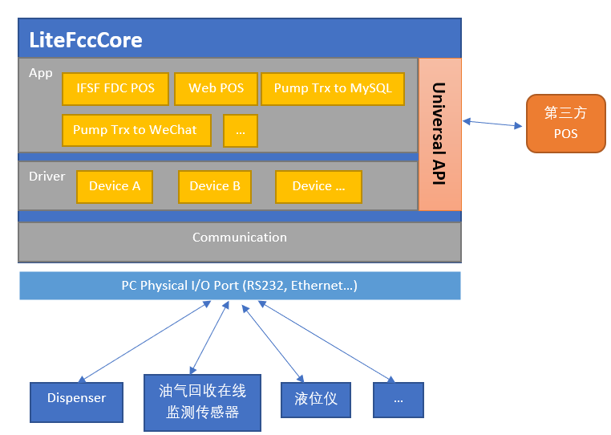
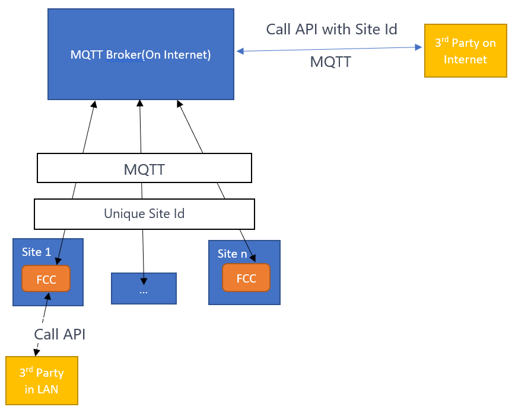

# LiteFccCore 简介

`FCC` 是加油站行业中的一类软件程序的统称, 指加油站中拥有直接连接和控制设备的软件程序.
`LiteFccCore` 即是上述概念的一个具体实现.

>以下谈到 **FCC**, **中控软件** 等都是指代 `LiteFccCore`

`LiteFccCore` 运行于放置在站点本地的一台配备有各类通讯接口(如串口, 以太网)的 PC 机上, 同时它内部集成了多种硬件驱动(通讯协议)支持, 即拥有控制设备行为和获取设备状态的能力.



# Universal API 简介

`LiteFccCore` 连接设备后, 本身会内置一些业务功能以控制设备, 同时也将通过开放接口的方式, 以便外部应用程序访问,从而实现的对硬件的简单快捷控制,并形成更丰富的业务功能集合。

像常见的关于油机的一些API：授权油机，获取油机状态，获取加油交易数据等等，都将通过符合一定技术规范的API以供外部调用，这类开放的接口称为 Universal API, 以下简称 API.

API 可以在站点的局域网内，或者公网上进行调用。



API 的底层协议支持通过**HTTP(webapi),WebSocket,MQTT**三种方式调用,但对于通过公网调用的接口， **仅支持** MQTT协议。

# 使用 Universal API

以下内容并不单独再区分API的调用方是位于站点区域网，还是公网，因为这两者对于API的调用几乎是相同的，但对于通过公网调用的接口，需要在所有API的调用时放入目标站点的唯一`SiteId`，而且**仅支持** MQTT协议。

`SiteId`的获取请咨询开发人员.

## 动态获取站点FCC所提供的API列表

依每个站里的 LiteFccCore 的具体配置(如连接了什么设备,开启了哪些功能)和所安装的硬件设备种类,FCC所提供的**API**将是不同的.

所以,外部应用程序应将API作为一种**动态资源**来对待,在每次与 LiteFccCore 重新建立连接后,都应该重新进行API发现,以获得有效的 API 调用入口和方式列表.

为了给外部提供一个获取当前所支持的API列表功能, LiteFccCore 提供了一个固定的 API,即 **发现API**,外部应用程序应首先通过调用此 API,来发现其它**动态API**.

发现API 可以由通过浏览器访问一个[可读性的版本](http://localhost:8384/Home/ShowMeApi?apiType=localmqtt&tags=,&format=pretty)

同时也提供一个供程序获取的版本,以下做介绍:

### 使用HTTP POST进行API服务发现

以下示例将返回 webapi 格式的所有API信息
```
URL: http://localhost:8384/u/?apitype=service&an=ShowMeApi&pn=ProcessorsDispatcher&en=Edge.Core.Processor.Dispatcher.DefaultDispatcher
Content-Type: application/json
Content: ["webapi",[]]"  
```

以下示例将返回 mqtt 格式的 API 信息
```
URL: http://localhost:8384/u/?apitype=service&an=ShowMeApi&pn=ProcessorsDispatcher&en=Edge.Core.Processor.Dispatcher.DefaultDispatcher
Content-Type: application/json
Content: ["localmqtt",[]]
```

如果要指定设备类型,即只需要发现某些类别的API,则需要传入特定的 API TAG, 以下示例将返回<i>Pump</i>(油机)相关的API:
```
URL: http://localhost:8384/u/?apitype=service&an=ShowMeApi&pn=ProcessorsDispatcher&en=Edge.Core.Processor.Dispatcher.DefaultDispatcher
Content-Type: application/json
Content: ["localmqtt",["Pump"]] 
```

### 使用MQTT进行API服务发现

 **mqtt server url and port:  mqtt://127.0.0.1:8388**, 因暂不对用户名和密码进行验证, 所以填写任意值均可。

publish to(请将+号换成唯一id以模拟RPC调用):
```
Topic: /sys/Edge.Core.Processor.Dispatcher.DefaultDispatcher/ProcessorsDispatcher/thing/service/ShowMeApi/+
Content: ["localmqtt",[]]
```
subscribe to(请将+号换成上一步publish时用的唯一id以模拟RPC调用):
```
Topic: /sys/Edge.Core.Processor.Dispatcher.DefaultDispatcher/ProcessorsDispatcher/thing/service/ShowMeApi_reply/+
```


下图是用某mqtt client工具进行调用show me api的示例:


## 解析API
发现 API 的返回结果是一个这样的数组结构, 每一个元素代表了一个 API.
```
[
{
	"providerType": "Applications.FDC.FdcServerHostApp",
	"providerTags": [
		"Pump",
		"IfsfFdcServer"
	],
	"providerConfigName": "Applications.FDC.FdcServerHostApp,FdcSer_ac8a48af9b2ce04d_0",
	"baseCategory": "Service",
	"apiName": "ChangeFuelPriceAsync_Reply",
	"path": "/Applications.FDC.FdcServerHostApp/Applications.FDC.FdcServerHostApp,FdcSer_ac8a48af9b2ce04d_0/thing/service/ChangeFuelPriceAsync_reply/+",
	"inputParametersExampleJson": "[1, 1]",
	"inputParametersJsonSchemaStrings": [
		"{\"title\": \"barcode\",\r\n  \"type\": \"integer\"\r\n}",
		"{\"title\": \"newPriceWithDecimalPoints\",\r\n  \"type\": \"number\"\r\n}"
	],
	"outputParametersExampleJson": null,
	"outputParametersJsonSchema": null,
	"description": ""
},
{
	"providerType": "Applications.FDC.FdcServerHostApp",
	"providerTags": [
		"Pump",
		"IfsfFdcServer"
	],
	"providerConfigName": "Applications.FDC.FdcServerHostApp,FdcSer_ac8a48af9b2ce04d_0",
	"baseCategory": "Event",
	"apiName": "OnFdcControllerStateChange",
	"path": "/Applications.FDC.FdcServerHostApp/Applications.FDC.FdcServerHostApp,FdcSer_ac8a48af9b2ce04d_0/thing/event/OnFdcControllerStateChange/post",
	"inputParametersExampleJson": null,
	"inputParametersJsonSchemaStrings": null,
	"outputParametersExampleJson": "{\r\n  \"newPumpState\": \"FDC_CONFIGURE\",\r\n  \"stateChangedNozzles\": [\r\n    {\r\n      \"pumpId\": 1,\r\n      \"physicalId\": 1,\r\n      \"logicalId\": 1,\r\n      \"realPriceOnPhysicalPump\": null,\r\n      \"expectingPriceOnFcSide\": null,\r\n      \"volumeTotalizer\": null,\r\n      \"logicalState\": \"FDC_CONFIGURE\"\r\n    }\r\n  ]\r\n}",
	"outputParametersJsonSchema": "{\r\n  \"definitions\": {\r\n    \"LogicalNozzle\": {\r\n      \"type\": [\r\n        \"object\",\r\n        \"null\"\r\n      ],\r\n      \"properties\": {\r\n        \"PumpId\": {\r\n          \"type\": \"integer\"\r\n        },\r\n        \"PhysicalId\": {\r\n          \"type\": \"integer\"\r\n        },\r\n        \"LogicalId\": {\r\n          \"type\": \"integer\"\r\n        },\r\n        \"RealPriceOnPhysicalPump\": {\r\n          \"type\": [\r\n            \"integer\",\r\n            \"null\"\r\n          ]\r\n        },\r\n        \"ExpectingPriceOnFcSide\": {\r\n          \"type\": [\r\n            \"integer\",\r\n            \"null\"\r\n          ]\r\n        },\r\n        \"VolumeTotalizer\": {\r\n          \"type\": [\r\n            \"integer\",\r\n            \"null\"\r\n          ]\r\n        },\r\n        \"LogicalState\": {\r\n          \"type\": [\r\n            \"string\",\r\n            \"null\"\r\n          ],\r\n          \"enum\": [\r\n            null,\r\n            \"FDC_CONFIGURE\",\r\n            \"FDC_DISABLED\",\r\n            \"FDC_ERRORSTATE\",\r\n            \"FDC_FUELLING\",\r\n            \"FDC_INVALIDSTATE\",\r\n            \"FDC_LOCKED\",\r\n            \"FDC_OFFLINE\",\r\n            \"FDC_OUTOFORDER\",\r\n            \"FDC_READY\",\r\n            \"FDC_REQUESTED\",\r\n            \"FDC_STARTED\",\r\n            \"FDC_SUSPENDED\",\r\n            \"FDC_CALLING\",\r\n            \"FDC_TEST\",\r\n            \"FDC_SUSPENDED_STARTED\",\r\n            \"FDC_SUSPENDED_FUELLING\",\r\n            \"FDC_CLOSED\",\r\n            \"FDC_AUTHORISED\",\r\n            \"FDC_UNDEFINED\"\r\n          ]\r\n        }\r\n      },\r\n      \"required\": [\r\n        \"PumpId\",\r\n        \"PhysicalId\",\r\n        \"LogicalId\",\r\n        \"RealPriceOnPhysicalPump\",\r\n        \"ExpectingPriceOnFcSide\",\r\n        \"VolumeTotalizer\",\r\n        \"LogicalState\"\r\n      ]\r\n    }\r\n  },\r\n  \"type\": \"object\",\r\n  \"properties\": {\r\n    \"NewPumpState\": {\r\n      \"type\": \"string\",\r\n      \"enum\": [\r\n        \"FDC_CONFIGURE\",\r\n        \"FDC_DISABLED\",\r\n        \"FDC_ERRORSTATE\",\r\n        \"FDC_FUELLING\",\r\n        \"FDC_INVALIDSTATE\",\r\n        \"FDC_LOCKED\",\r\n        \"FDC_OFFLINE\",\r\n        \"FDC_OUTOFORDER\",\r\n        \"FDC_READY\",\r\n        \"FDC_REQUESTED\",\r\n        \"FDC_STARTED\",\r\n        \"FDC_SUSPENDED\",\r\n        \"FDC_CALLING\",\r\n        \"FDC_TEST\",\r\n        \"FDC_SUSPENDED_STARTED\",\r\n        \"FDC_SUSPENDED_FUELLING\",\r\n        \"FDC_CLOSED\",\r\n        \"FDC_AUTHORISED\",\r\n        \"FDC_UNDEFINED\"\r\n      ]\r\n    },\r\n    \"StateChangedNozzles\": {\r\n      \"type\": [\r\n        \"array\",\r\n        \"null\"\r\n      ],\r\n      \"items\": {\r\n        \"$ref\": \"#/definitions/LogicalNozzle\"\r\n      }\r\n    }\r\n  },\r\n  \"required\": [\r\n    \"NewPumpState\",\r\n    \"StateChangedNozzles\"\r\n  ]\r\n}",
	"description": "When pump state changed, the event will fired"
}
]
```
`providerType`是提供 API 的插件名称,每个插件对接了不同的设备.

`apiName`是指 API 的名称,每个 providerType 中的 apiName 是唯一的,请用此值来唯一确定一个将要调用的 API.

`baseCategory`是指此 API 的分类,现有3种分类, `service`是指外部应用可以主动调用的,就像一个rpc函数, `event`是指由LiteFccCore主动发起的,外部则被动来接收,就是一个事件,如某硬件设备进入了异常状态,则会引发一个event.

`path`是指调用此 API 的路径,如果 baseCategory 是`service`,如外部应用使用 mqtt 形式的调用 ,则请直接调用此 path 进行 publish. 而对于 event,则 subscribe 它并等待通知.

`inputParametersJsonSchemaStrings`是指输入参数的 json schema,在调用时,输入的参数必须符合此规则,如果为 null,则说明此API不需要输入.

`inputParametersExampleJson`是指输入参数的示例 json 内容,以帮助调用者理解如何构建输入参数.

`outputParametersJsonSchema`是指输出结果的 json schema,外部应用可以根据它来预期返回值的结构.


## 调用具体的API

* 与开发者联系,咨询所要访问的API的`tag`,`providerType`,`apiName`
* 通过 `showmeapi` API进行服务发现, 基于第一步中的信息,确定自己要调用的API,并通过发现结果以获取调用技术细节
* 发起实际调用

### 油机API

外部调用端一般通过 FdcServerApp 应用插件所提供的 API 来进行油机相关功能的使用。
请用tag: `IfsfFdcServer` 来进行相关API的发现，如果列表为空，则说明 FdcServerApp 未启用，需要人工配置和启用。

#### Service

* GetPumpsLayout

获取中控上所有油枪的基本信息。
传入参数请放 _null_ 即`[null]`即可，返回信息示例如下：


第一层有4个元素，说明中控连接并且配置了共4个加油点，各字段解释请看注释内容


 
```
[
   {
     "Name": "Bogus_Pump handler",
     "PumpId": 1,    #加油点1
     "Nozzles": [
       {
         "LogicalId": 1,   #此加油点上的1号逻辑枪
         "RealPriceOnPhysicalPump": 831,   #此逻辑枪上的真实价格
         "SiteLevelNozzleId": 1,   #此逻辑枪的全站枪号
         "ProductBarcode": 0,   #此逻辑枪上的油品代码
         "ProductName": "0#"   #此逻辑枪上的油品名称
       }
     ],
     "AmountDecimalDigits": 2,   #此逻辑枪的单笔交易中金额数值中的小数点位数
     "VolumeDecimalDigits": 2,   #此逻辑枪的单笔交易中升数数值中的小数点位数
     "PriceDecimalDigits": 2,   #此逻辑枪的单笔交易中的价格部分的小数点位数
     "VolumeTotalizerDecimalDigits": 2   #此逻辑枪的升累计数值的小数点位数
   },
   {
     "Name": "Bogus_Pump handler",
     "PumpId": 2,
     "Nozzles": [
       {
         "LogicalId": 1,
         "RealPriceOnPhysicalPump": 831,
         "SiteLevelNozzleId": 2,
         "ProductBarcode": 0,
         "ProductName": "0#"
       }
     ],
     "AmountDecimalDigits": 2,
     "VolumeDecimalDigits": 2,
     "PriceDecimalDigits": 2,
     "VolumeTotalizerDecimalDigits": 2
   }
 ] 
```

* ChangeFuelPriceAsync

改变某油品的价格
输入参数示例 `[1, 6.78]`， `1`是指目标油品号，此号所关联的油枪请通过`GetPumpsLayout`接口API来获取，`6.78`是指新的价格，它即是最终目标价格，无需再考虑油机小数点的问题。

#### Event

* OnFdcControllerStateChange

When pump state changed, the event will fired

* OnCurrentFuellingStatusChange

When pump in fueling state, the fueling progress will be reported via this event

* OnFdcFuelSaleTransactinStateChange

When pump transaction state changed, like locked or cleared by other POS, the event will fired


### 液位仪API

即ATG，可通过`TAG: ATG`进行服务发现。

#### Service

* GetTanksAsync

获取中控上所有油罐的基本信息。

* GetTankReadingAsync

读取某个油罐的液位读数

* GetTankDeliveryAsync

读取某个油罐的进油（卸油）数据
输入参数示例`[1,8,0,"2020-04-01T18:25:43.511Z"]`，最后一个时间戳表示是查询此时间段以后的进油数据。

* GetTankInventoryAsync

暂时不用

* GetTankAlarmAsync

查询液位仪的历史报警信息，此API需要液位仪端支持才可以得到数据。

#### Event

* OnStateChange

当与液位仪的连接发生变化的时候触发，如连接断开，或者连接重新建立。

* OnAlarm

当获取到液位仪端存在报警时，则触发，此API需要液位仪端支持才可以得到数据。