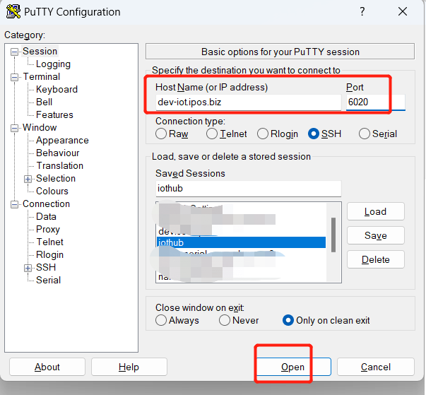
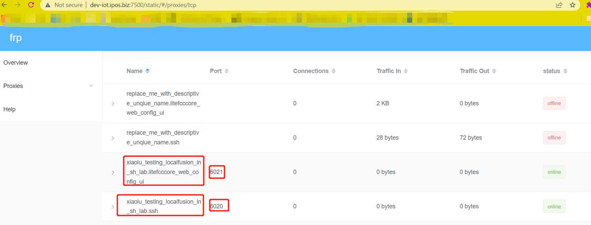
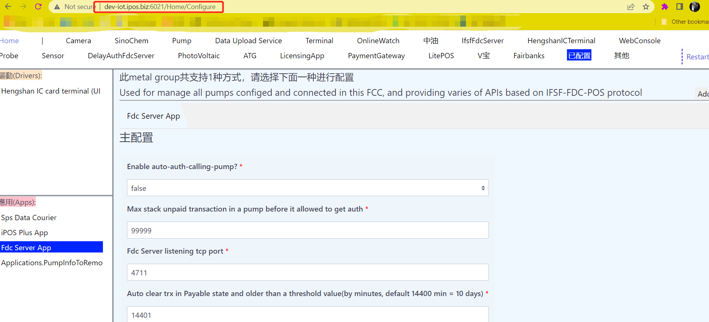

## Send hex data to the Tcp server via netcat
Send hex data to the Tcp server, and display the response with hex-ASCII table
```
echo -e "\x50\x20\xFA" | netcat 192.168.1.119 1234 | hexdump -C
```


## Install Frp client on Local Fusion
Download frp release (server and client are put together) from [frp release](https://github.com/fatedier/frp/releases/download/v0.43.0/frp_0.43.0_linux_arm.tar.gz) and untar it:
```
cd /home/linaro/Downloads/
tar -xzvf frp_0.43.0_linux_arm.tar.gz
# then the release files are in: /home/linaro/Downloads/frp_0.43.0_linux_arm/
```

Edit `frpc.ini` with
```
nano /home/linaro/Downloads/frp_0.43.0_linux_arm/frpc.ini
```
input below content and save:
```
[common]
server_addr = dev-iot.ipos.biz
server_port = 7000
user = {{ .Envs.FRP_USER }}
[ssh]
type = tcp
local_ip = 127.0.0.1
local_port = 22
remote_port = {{ .Envs.FRP_SSH_PORT }}

[litefcccore_web_config_ui]
type = tcp
local_ip = 127.0.0.1
local_port = 8384
remote_port = {{ .Envs.FRP_LITEFCCCORE_WEB_CONFIG_UI_PORT }}
```
Create a system service for auto start the `frp client` when system started:

```
sudo nano /etc/systemd/system/frpc.service
```

input below content(it defaultly use `6020` and `6021` port, you should gurantee it's **UNIQUE for all boards**, so please change it):

```
[Unit]
Description=Frp client
Wants=network.target
After=network.target
[Service]
Environment="FRP_USER=replace_me_with_descriptive_unqiue_name"
Environment="FRP_SSH_PORT=6020"
Environment="FRP_LITEFCCCORE_WEB_CONFIG_UI_PORT=6021"
#before start the service, always sleep 5 second, for wait the system ready?
ExecStartPre=/bin/sleep 5
WorkingDirectory=/home/linaro/Downloads/frp_0.43.0_linux_arm/
ExecStart=/home/linaro/Downloads/frp_0.43.0_linux_arm/frpc -c 'frpc.ini'
Restart=always
#Restart service after 10 seconds if this service crashes:
RestartSec=10
[Install]
WantedBy=multi-user.target
```

`ctrl+o`, `y`, `ctrl+x`, save and exit from nano, then activate the service:
```
sudo systemctl enable frpc.service
sudo systemctl start frpc.service
# sudo systemctl status frpc.service
# sudo systemctl daemon-reload
```

## Install frp server service
this should done at your cloud server side with public ip and domain name.

```
[Unit]
Description=Frp server
Wants=network.target
After=network.target
[Service]
#before start the service, always sleep 5 second, for wait the system ready?
ExecStartPre=/bin/sleep 5
WorkingDirectory=/home/shao/Downloads/frp_0.43.0_linux_amd64/
ExecStart=/home/shao/Downloads/frp_0.43.0_linux_amd64/frps -c 'frps.ini'
Restart=always
#Restart service after 10 seconds if this service crashes:
RestartSec=10
[Install]
WantedBy=multi-user.target
```
Then you can use it like:



Also, there's a frp build-in web service for check the global connection list
> http://dev-iot.ipos.biz:7500/static/#/proxies/tcp
> default username and password are: admin1 and  admin1

you can see:


Then you can access LiteFccCore config UI page in your local PC like:

