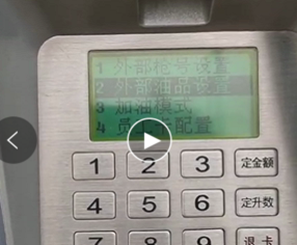
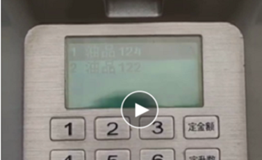
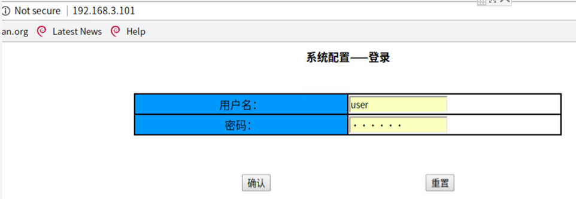
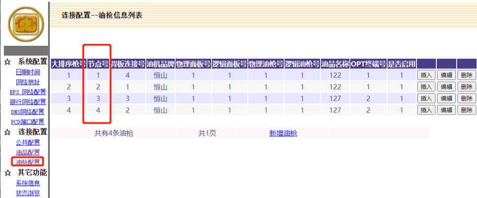

在中油站中，加油机一般分为以下几个类型:
# 恒山中油TQC油机

此机型实际上就是标准TQC油机但针对中油的要求做了些小改动，与较老的DIT中油油机不同之处有:
- 油机 **并未提供 web 后台**

所以在同一个局域网中的PC上的浏览器中，输入油机的IP地址是看不到像DIT油机一样的配置界面的。
- 油机的油机端配置仅可在加油机上的键盘上进行

如加油机的IP地址，与后台（中控程序）通讯的TCP端口，各油枪的油品号（在油机键盘上表示为 **“外部油品号”** ）等，都只能在油机键盘上进行，且仅主油枪（一般其地址值为`Fp0x21`，一般可以通过正对主板，左手边的油枪即为主油枪）上的键盘可以进行。

> 一块油机主板的IFSF NODE值，在此油机型号上，根据经验，其实并不影响与中控的通讯，任何都可以，这可能和不严格的油机技术实现有关，所以一个站有重复的也没有关系，因为其实在一个油机的IP地址上，肯定只会有唯一的IFSF NODE

## 油品号更改

下图为涉及进行 **油品号更改** 的主要流程界面，图2中有两行数据，表示此台油机最多可以支持两种油品，序号`1、2`分别硬件固定指向了`IFSF product db 0x41, 0x42`，然后，分别在这两项上，点击键盘上的 **“确定”** 进去后，就是设置 **“外部油品号”** ，此号才是`IFSF `中的`product code`，即中控上所使用的油品号，中控端应严格按此`product code`进行油枪油品号配置。

菜单进入路径：设置 ->   

->  

# 恒山中油DIT
DIT是一类较老用于中油站的油机，大概生产于2013年及以前？？ 之后都由 恒山中油TQC油机 所替换。
判断它最好的方式就是在同局域网内的PC上，用浏览器打开油机的IP，如果看到像下图：

 

则说明它就是DIT油机，用户名 **user** , 密码 **123456** 

应注意的是，`IFSF NODE`不再是以往的配置到一块主板上的，而是配置到一块主板的 **每把油枪** 上的，且一块主板上的每把枪必须配置 **全站唯一** 的`IFSF NODE`，而 > FCC中对油机的配置(即每个`Pump`的`IFSF NODE`)必须和油机端的配置一致，才可以正常通讯，即在FCC中，每块主板配置下的多把枪上，每把枪都也应该有不同的IFSF NODE值，下图中的节点号，即此油机上各油枪的IFSF NODE值：
 

## 油品号更改
1. 打开目标油机的WEB管理页面。   
2. 如果 待新加油品不存在，则添加一个新的油品，能用的 ‘油品名称（油品号）’根据经验是有范围的，如 128(2)，127(7)，122(3)，124(3)，-20(20)，-10(10) ，不要随便自己定义，奇怪问题会出现。     
3. 分配新的油品至相应的油枪，点确认后，建议再刷新一次当前页面，确保油机保存成功。
4. 更新FCC的配置，将目标油枪上的productBarcode和 description均改成POS上希望的油品名称，如0，92，95等。    
5. 关闭FCC    
6. 重启加油机    
7. 开启FCC。

# 富仁中油DIT
与恒山DIT类似
 
