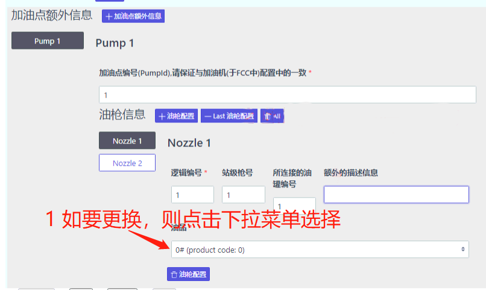

# 加油机类型
在中油站，加油机分为几个类型，各个类型的 _加油机端_ 与 _中控端_ 配置均**有所不同** ，所以应先**确定**加油机类型。
# 确定加油机类型
## 恒山中油TQC油机

此机型实际上就是在 _恒山标准TQC油机_ 的基础上，针对中油的需求做了些改动，与 _中油DIT油机_ 不同之处有:
- 油机**不**提供 WEB 后台
	请先准备一台与目标油机位于同一个局域网中的 PC 机。
	> **确保  PC 机可以 PING 通**加油机

	在 PC 上的浏览器中，输入油机的 IP 地址是, 看是否能看到一个可视化的网页登陆界面，如果没有话，则这说明此油机型号为 _恒山中油TQC油机_。
- 加油机端配置**仅**可在加油机上的键盘上进行

	加油机端的配置一般包括：
	 - 加油机的 IP 地址
		中控程序将通过此地址与加油机通讯
	 - 与后台（中控程序）通讯的 TCP 端口
	 - 各油枪的油品号
	    在油机键盘中的菜单项上表示为 **外部油品号**.

	以上配置只能在油机键盘上进行，且仅主油枪（一般可以通过人正面对主板，左手边的油枪即为此主油枪的方式进行定位。其 IFSF Fp 地址值为 `0x21`，）上的键盘可以进行。

	如果当前油机符合上述描述，则为 _恒山中油TQC油机_。

### 油品号更改

油品号更改涉及油机端与中控端，此处仅对油机端的流程进行说明。

下面2张图片为油机 **主键盘** 上所涉及油品号更改流程的界面，请通过此菜单项进入更改菜单：

 _1. 设置 -> 2.:_  

图2中有两行数据，表示此台油机最多可以支持两种油品

> 序号`1、2`分别硬件固定指向了`IFSF product db 0x41, 0x42`

分别在这两项上，点击键盘上的 **确定** 进入后，即是设置 **外部油品号** 的值（此值即 `IFSF Product code`)，即中控上所使用的油品号，如果更改此值，中控端也应严格按此值更新相应油枪上的油品号配置值。

 _菜单进入路径：_  

->  

__记录油品号与油枪的关系，稍后将用于中控端的油品名称修改过程中。__

## 恒山中油DIT油机
DIT是一类较老用于中油站的油机，大概生产于2013年及以前？？ 之后都被  _恒山中油TQC油机_  所替换。

请先准备一台与目标油机位于同一个局域网中的 PC 机。

> **确保  PC 机可以 PING 通**加油机

判断它最好的方式就是在同局域网内的 PC 上, 在浏览器上输入油机的 IP 地址。

**假设** 油机 IP 为 `192.168.3.101`,则输入 `http://192.168.3.101`，如果能看到类似下图：

 

则说明它就是 _恒山中油DIT油机_ .

> 用户名 **user** , 密码 **123456** 


### 油品号更改
1. 在浏览器中打开目标油机的 WEB 管理页面。  
**假设** 油机 IP 为 `192.168.3.101`,则输入 `http://192.168.3.101`
2. 查看当前油机已经存在的油品列表


如果 _待新加油品_ 不存在，则添加一个新的油品，能用的  _油品名称_ 以及相对应的 _油品号_ 根据经验是有范围的，建议值如下：

 **油品名称**   <--->  **油品号** 

 128   <--->     2

127   <--->     7

122  <--->      3

124   <--->     3

-20  <--->      20

-10  <--->      10

建议不要随便自己定义，奇怪问题会出现。 
新增或者更改油品并保存成功后，建议再次刷新一次当前页面并再次查看，确认更改已经保存成功。

__记录油品号与油枪的关系，稍后将用于中控端的油品名称修改过程中。__

> 仅油品号是实际影响中控和POS系统的，即上述油品号将用于加油机与中控，以及中控机与POS机之间的通讯，油品名称仅存在于加油机内部

    
3. 选择和编辑目标油枪


分配新的油品至相应的油枪:


> 此处显示的是油品名称，而非中控上将使用的油品号

点 **提交** 将保存至油机，建议再刷新一次当前页面，再查看一下配置值，确保油机保存成功。


## 富仁中油DIT
与 _恒山中油DIT油机_ 类似，此型号油机可以参考以下油机侧面的铭牌进行确认:


 

唯一的区别是此油机的网页管理后台的用户名是  _furen_     密码则是动态的，规则是 `固定字符串haosheng`+`当天的日期` 如：   haosheng20220104

> 如果按上述规则登陆页面时，报密码错误，则有可能是油机的时间设置不对，请于油机键盘上查看油机的时间，并手动设置为当前的自然时间，再尝试依上述规则登陆。

如果通过中控上（或者PC上）的浏览器打开油机端的配置界面并未出现图形界面(油机端程序的bug)，而是一些HTML文字内容，则需要在中控上（或者PC上）新建一个以下内容的文件，其中的IP地址的部分请替换为你**实际的目标油机**的IP地址，可见以下示例中用的是 _192.168.3.101_ ,并命名此文件为 _login.htm_：


```
<!--        文件范例：login.htm     -->
<!--        文件说明：系统登录      -->

<html>
	<head>
		<title>系统登录</title>
	</head>
	<body bgcolor = #00FF80 >	
		<br />
		<br />
		<form method="post" action="http://192.168.3.101/cgi-bin/login.cgi">
		<table class="Login" border=1 width=420 align=center>
		<caption>系统登录
		<br />
		<br />
		<tr align=center>
			<td id="td_User">用户名</td>
			<td ><input type="text" name="text_User" id="text_User" style="width:150;text-align:center;"></td>
		</tr>
		<tr align=center>
			<td id="td_Password">密&nbsp;&nbsp;码</td>
			<td><input type="password" name="password_Password" id="password_Password" style="width:150;text-align:center;"></td>
		</tr>
		</table >
			<p align=center><input type="submit" name="btnSubmit" id="btnSubmit" value="确定" class="btn">
				&emsp;<input type="reset" value="重置" class="btn">
			</p>
		</form>
	</body>
</html>
```
然后双击此文件，将自动开启浏览器以展示此界面，此时应可见到可视化的油机配置登陆页面，请输入用户名和密码就可以开始对油机配置进行更改了。

具体的配置流程和 _恒山中油DIT油机_ 是类似 的，请参考相应内容。

# 中控程序(LiteFccCore)的使用与配置
## 运行
在Windows平台上，运行相应的`LiteFccCore.exe`即可。
在Linux平台上，运行`dotnet LiteFccCore.dll`即可。

## 使用
### 查看当前油罐列表和状态
通过 http://localhost:8384/TankDetails 

### 查看油枪列表和状态
> **注意** ，`外部延迟授权模式`的中油站不支持此功能查看

通过 http://localhost:8384/SmartFuel

### 手工改油价

通过 http://localhost:8384/swagger/index.html 可以行使多项高级功能，如进入手工改油价功能入口：


输入改油价的参数：


查看改油价结果，下图为改价成功的返回结果显示：


如果`Response Body`中是以下类似这样的内容，则说明 **改价失败了** ，一般原因可能是输入的 **油品并不存在于任何油枪** 上，或者油机端各种原因：


## 配置

通过浏览器打开网页 http://localhost:8384/Home/Configure 可以看到以下配置的主界面：


### 配置加油机驱动

先点击最上方的 _加油机_ 按钮


左侧可以看到油机的驱动列表，接下来请根据**现场的油机类型**进行具体的驱动选择。

#### 配置 _恒山中油TQC加油机_ 驱动


对于此油机类型，一台油机中有一块主板, 且拥有独立 IP 地址，配置均需要通过主油枪的键盘进行更新.
> 以上配置只能在油机键盘上进行，且仅主油枪（一般可以通过人正面对主板，左手边的油枪即为此主油枪的方式进行定位。其 IFSF Fp 地址值为 `0x21`，）上的键盘可以进行。

主板即是一个 IFSF NODE，而主板上的各 IFSF 加油点 即 IFSF Fp 的地址值为 `0x21-0x24`，而各 IFSF Fp 上的各 IFSF Nozzle 地址值为 `0x11-0x18`, 典型分布可参考：


> 而此类油机主板所配置的 IFSF NODE 值，根据经验，并不影响与中控的通讯，即任意值、甚至同站出现重复值都可以正常工作，大概因为各主板已经拥有了独立的 IP


#### 配置 _恒山中油DIT加油机_ 驱动
请先在油机端键盘上配置好油机的 IP 地址。

> 确保中控机可以 **PING 通**加油机

选择驱动：


点击 Add 添加一个驱动:


> __每台__ 油机需要添加一个驱动，所以多台油机需要重复此段落中描述的步骤

填写参数请参考：


然后点击底下的 _Next_ 以到下一个配置页:
> 截图中的黑白图片请忽略


其中 _油机心跳数据包端口号_ 和 _中控心跳数据包端口号_ 需要从油机端的配置页面中获取,参考：


其中 _油机接收控制数据包端口号_ 和 _中控接收控制数据包端口号_ 需要从油机端的配置页面中获取,参考：


> **对于此类型油机的额外说明信息**:
>
> 每块主板拥有一个 IP 地址，板上所有油枪是同一个 Ifsf FP 0x21，而每把油枪拥有不同的 `IFSF NODE` 值，且每把枪必须配置为 **全站唯一** 的 `IFSF NODE` 值，即一般就是全站枪号。
> 在油机所提供的 Web 配置界面中，下图中的`结点号`值即为 `IFSF NODE` 值：

> 中控程序进行驱动配置时，在配置`Pump`的`IFSF NODE`（即 `IFSF节点`）时必须和油机端的配置一致，才可以正常通讯：
 

最后保存所有配置，再重启中控即可生效:

 

### 配置授权油机应用

添加应用,一个站仅添加一次即可:

 

配置油品:
>注意,`油品编号`需要从油机端配置中获取


配置油枪额外信息:
>站点中的每一把油枪都需要配置一次,请点击 `+加油点额外信息` 以添加多个配置


保存并重启中控即可.
### 更改油品名称

#### 中控程序是`2.0`的 **老版本**
则将目标油枪上的 `productBarcode` 改为以上新加入或者已更改的油品号，以及  `description` 改为POS上希望的油品名称(即油罐中的`油罐油品名称`)，如 `0,92,95,10` 等, 示例：

  

保存并重启中控即可.
#### 中控程序是`3.0`版本
依图中进入此插件的具体配置页：


先查看目标油品是否已经存在了（之前可能已经添加过了):


> 请确上图中的`油品编号`与加油机端所配置的`油品号`一致

查看和更改目标油枪上的油品分配状况：



点击底部的 _Save_ 保存配置。
再关闭中控机。
重启（断电再上电）更改过油品的加油机
开启中控程序