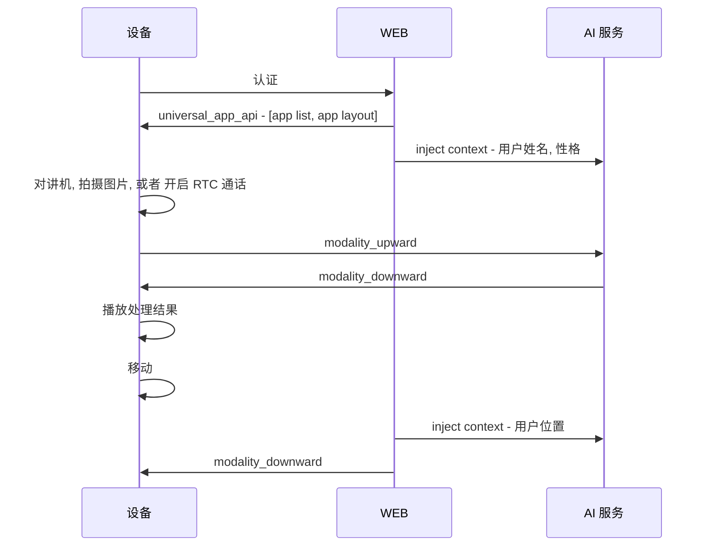
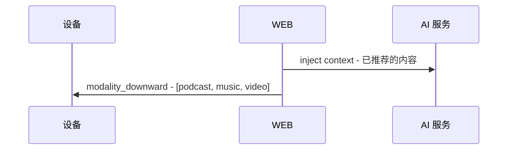
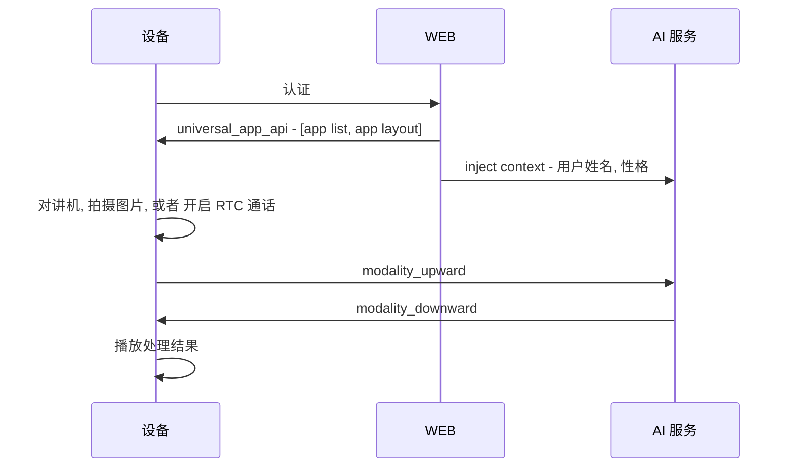
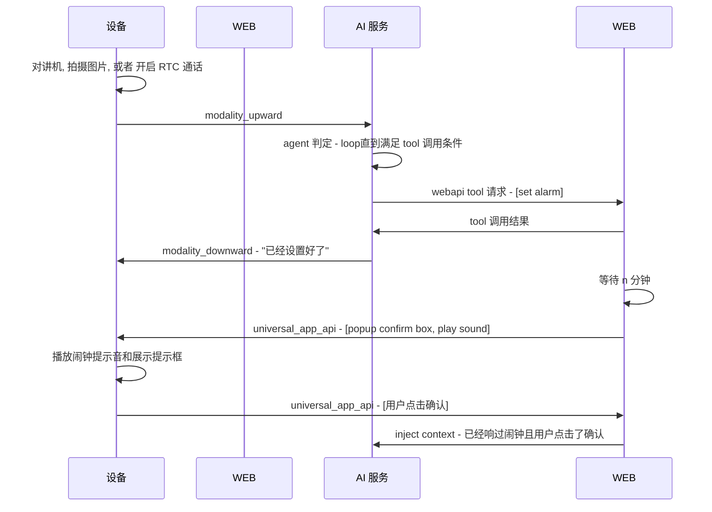
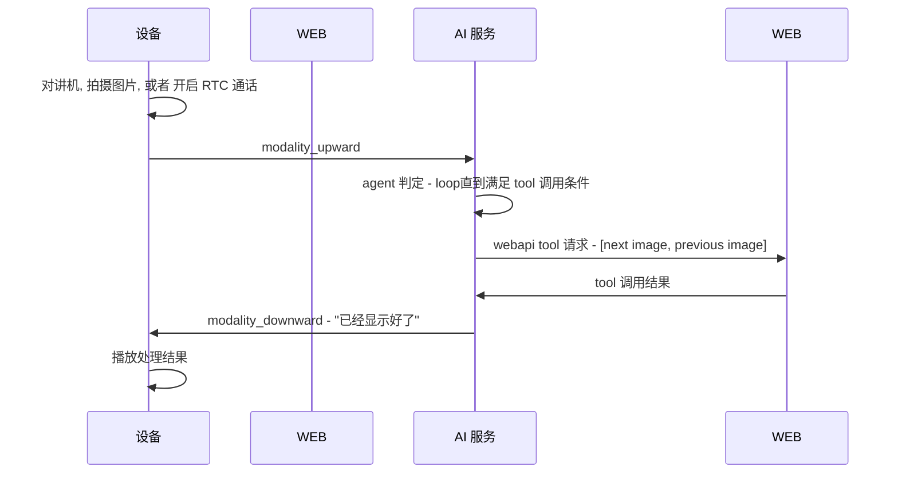
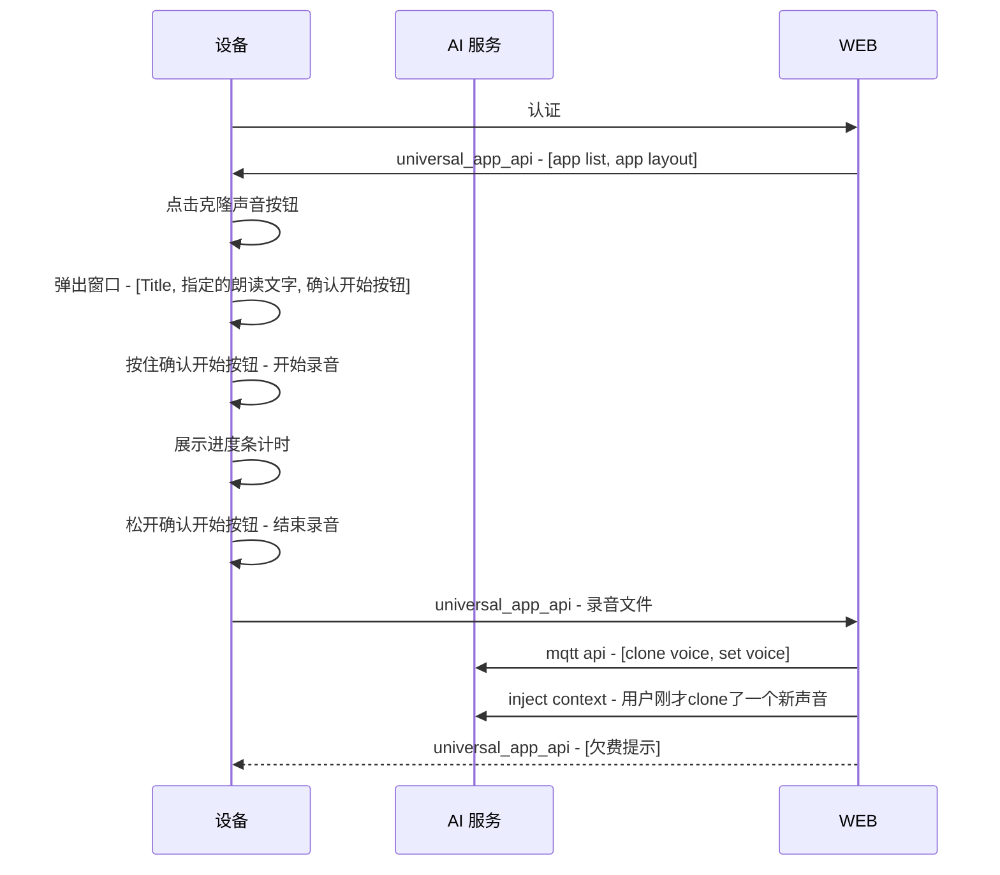

# 导览机
## 用户故事
### 基本语音对话
用户拿起设备, 用对讲机或者 RTC 进行通话, 设备将用户的语音发送到 AI 服务进行处理, AI 服务将处理结果返回给设备, 设备播放内容。

### 后台推荐内容
用户在设备上进行语音对话时, AI 服务根据用户的 context (姓名, 性格, 位置等) 推荐内容。

# 相框
## 用户故事
### 基本语音对话
用户拿起设备, 用对讲机或者 RTC 进行通话, 设备将用户的语音发送到 AI 服务进行处理, AI 服务将处理结果返回给设备, 设备播放内容。

### 请求定闹钟
用户在设备上进行语音对话时, 说到: "请为我设置一个`n`分钟后的闹钟" 或者 "请为我设置一个未来时刻的闹钟".    

### 请求显示下一张图片
用户在设备上进行语音对话时, 说到: "请为我显示下一张图片" 或者 "请为我显示上一张图片".    

### 点击按钮请求克隆声音
用户在设备上点击触摸屏上的`克隆声音`按钮, 弹窗出现位于**右下角**新窗口, 其中包括:    
* Title    
例如: "以正常的 音调 和 语速 朗读下面的文字"
* 指定的朗读文字    
正中位置, 内容例如: "如果能再给我一天光明, 我会让你看到我最美的一面! 唉, 可惜了."
* 确认开始按钮
按住后, 开始录音, 展示进度条计时, 松开时结束录音, 如果录音时间过长或者过短, 则提示用户重新录音.

### 点击按钮请求进行会议语音记录
用户在设备上点击触摸屏上的`会议语音记录`按钮, 点击后先检查后台没有设置电子邮件地址, 如果没有, 则直接提示必须先提供.    
弹窗出现位于**右下角**新窗口, 其中包括:    
* Title
例如: "会议语音记录"
* 确认开始按钮
点击后, 开始录音, 按钮变成"取消"; 展示进度条计时, 如果录音时间过短, 则提示内容过短, 将取消本次功能.
实际的技术实现将是`RTC + ASR + disabled LLM` ??? WEB端收取所有ASR结果, 再单独送到 AI 服务进行处理, 处理结果返回给WEB, WEB再发邮件???
