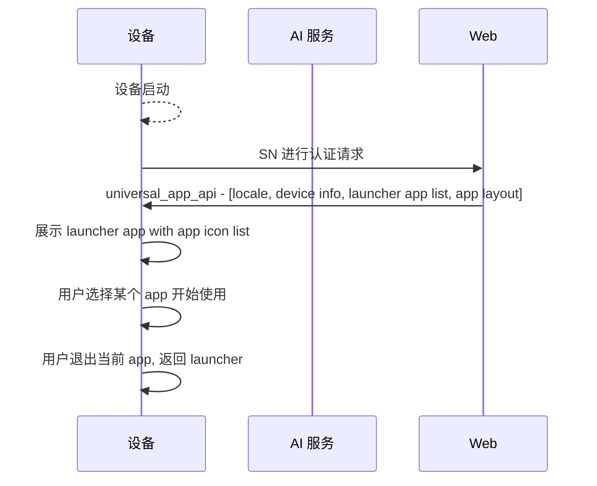
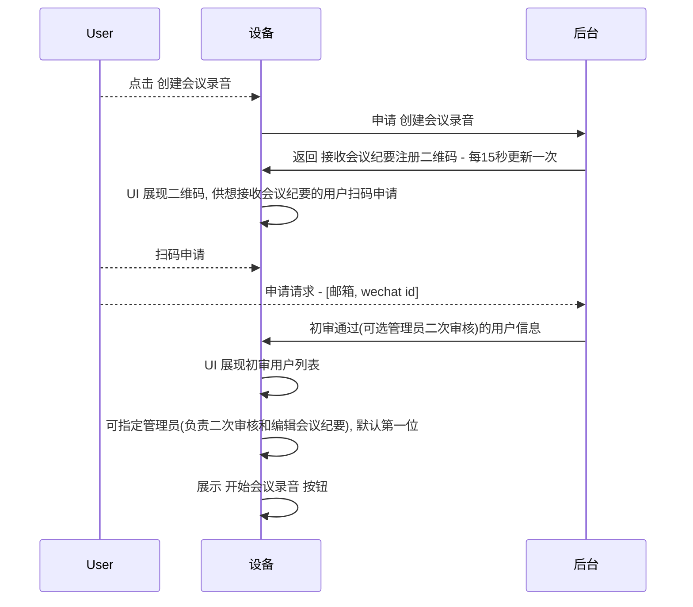
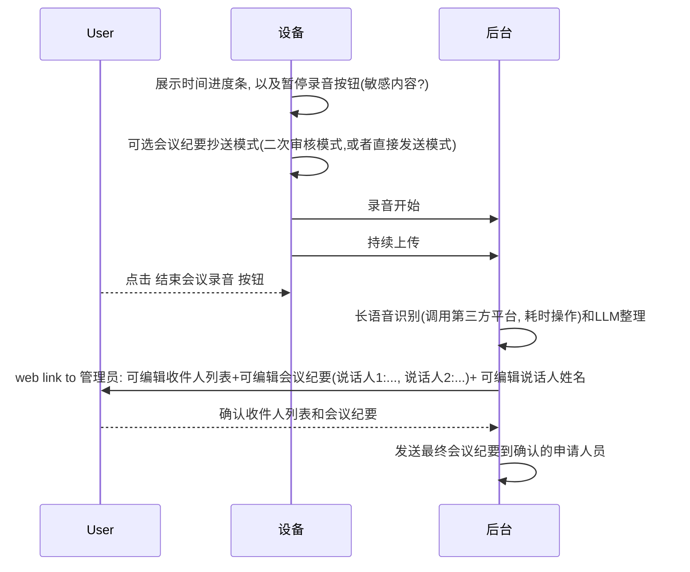

# Basic
## 基本流程概览   
> 实线表示当前项目中有实际开发任务.
> 虚线表示无实际开发任务.

## app layout
均采用`chatter-basic` 布局.

# 智能相册
在当前智能相册已经有的功能基础上, 增加 AI 相关的功能.   
项目将采用创建一个新的 app 来实现, 应与现有智能相册功能隔离, 以下功能实现均于此新 app 中.
## 用户故事
### 会议录音纪要应用
#### 准备会议录音

#### 开始会议录音

### 点击设备侧按钮请求克隆声音
用户在设备上点击触摸屏上的`克隆声音`按钮, 弹窗出现位于**右下角**新窗口, 其中包括:    
* Title    
例如: "以正常的 音调 和 语速 朗读下面的文字"
* 指定的朗读文字    
正中位置, 内容例如: "如果能再给我一天光明, 我会让你看到我最美的一面! 唉, 可惜了."
* 确认开始按钮
按住后, 开始录音, 展示进度条计时, 松开时结束录音, 如果录音时间过长或者过短, 则提示用户重新录音.

### 手机侧进行克隆声音
用户在设备上点击触摸屏上的`克隆声音`按钮, 弹窗新窗口, 其中包括:    
* TITLE   
例如: "在手机上克隆声音"
* 正文    
"请用手机扫描以下二维码, 进行克隆声音"

# 导览机
## 用户故事
* app layout    
    符合 `chatter-basic`
* app layout style
    none
### 基本对话
用户拿起设备, 用对讲机或者 RTC 进行通话, 设备将用户的语音发送到 AI 服务进行处理, AI 服务将处理结果返回给设备, 设备播放内容。

### 后台推荐内容 via 用户点击
AI 服务根据用户的 context (姓名, 性格, 位置等) 推荐后台已经生成的固定内容, 用户需要在触摸屏上点击确认后播放.

### 后台推荐内容 via Agent
AI 服务根据用户的 context (姓名, 性格, 位置等) 推荐后台已经生成的固定内容, 用户通过语音选择是否进行播放.

> 技术可行, 暂不实现
# 相框
* app layout    
    `chatter-basic` with dynamic func buttons: [克隆声音]
    需要线下约定`克隆声音`按钮的交互, 可见下文说明    
* style    
    请考虑: 设备屏幕尺寸11寸;设备重量轻(不方便单手指直接点击?);app常规状态下应全屏显示多媒体内容;
## 用户故事
### 基本对话

### 请求定闹钟
用户在设备上进行语音对话时, 说到: "请为我设置一个`n`分钟后的闹钟" 或者 "请为我设置一个`未来时刻`的闹钟".    

### 请求显示下一张图片
用户在设备上进行语音对话时, 说到: "请为我显示下一张图片" 或者 "请为我显示上一张图片".    

### 语音请求进行设备设置
调节音量为示例.

