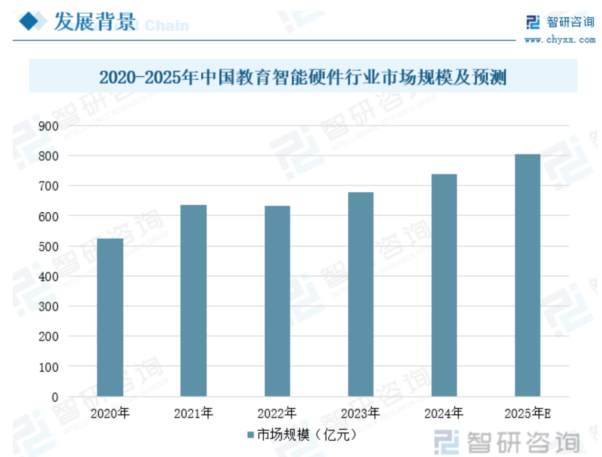
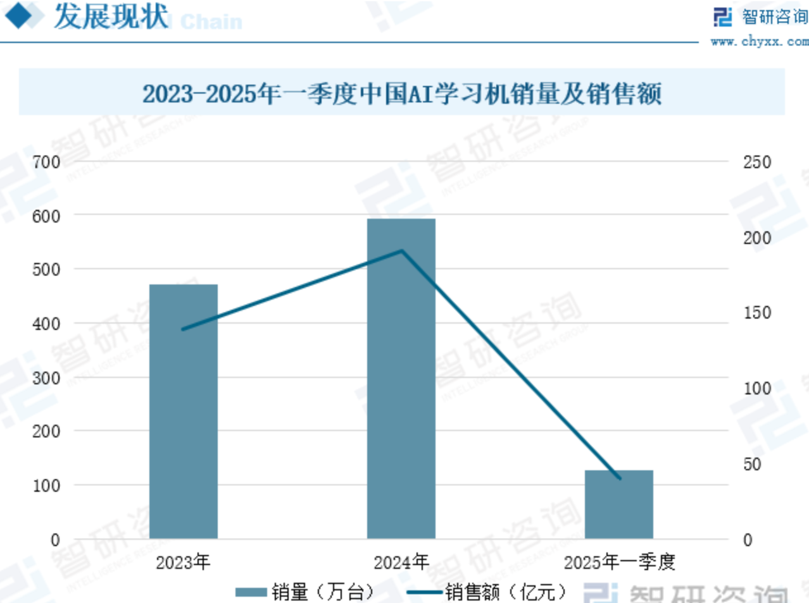
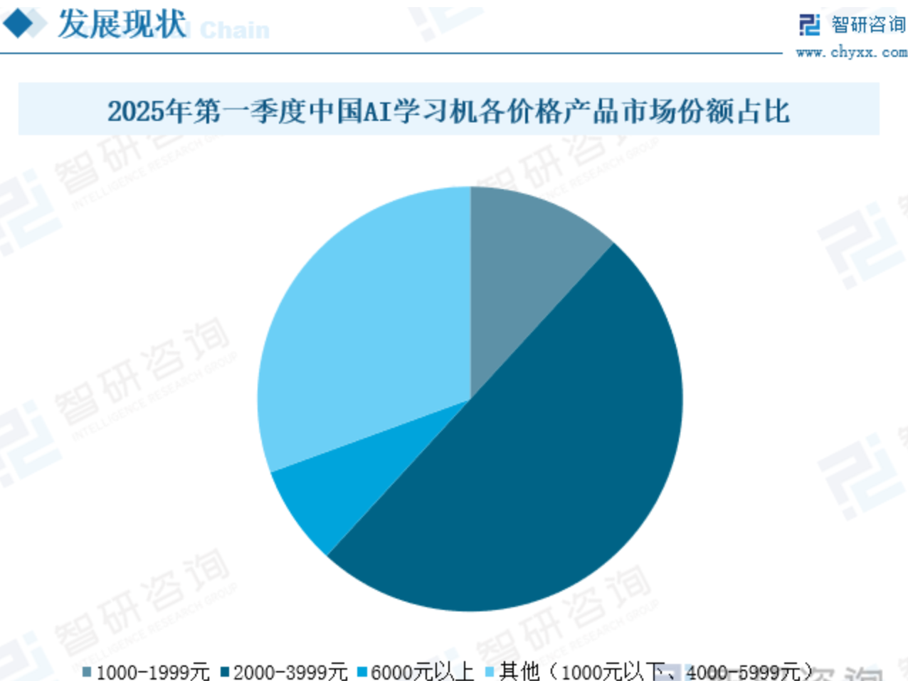
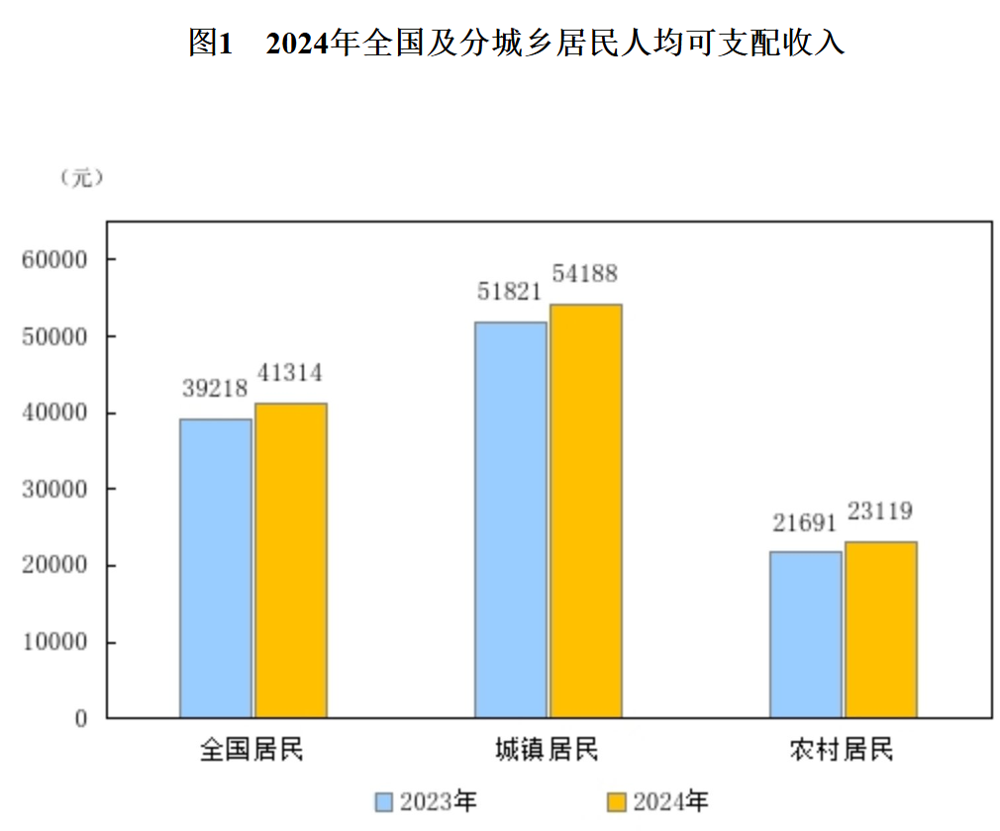
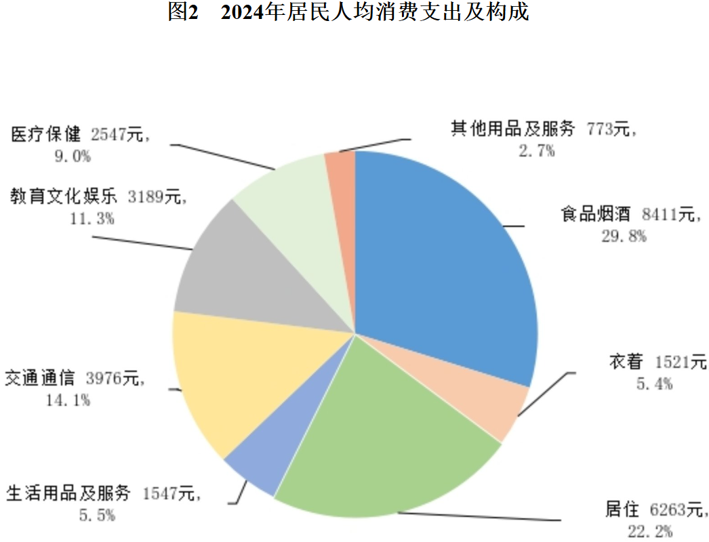
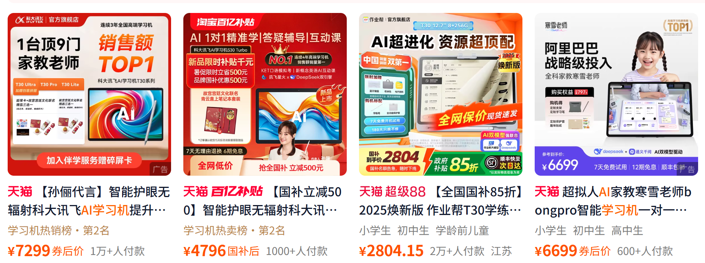
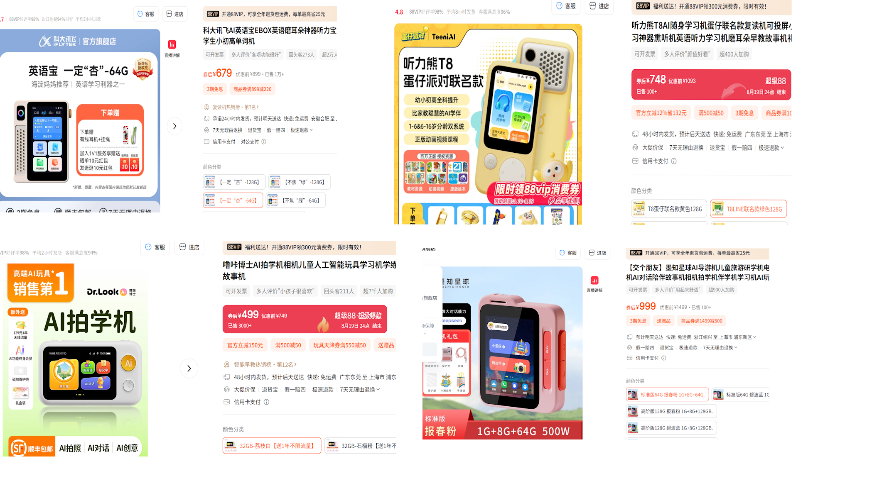

本文针对K12教育(6-18岁)
# 环境

## AI技术发展
* LLM 能力发展
达到人类博士水平? LLM 在普通模式下对于知识的记忆和理解能力达到了非常高水平, 在`with thinking`模式下, 它的推理能力和创造力也有了显著提升.
* 多模态技术发展
语音交流能力强, 且模型可以理解视频和图片, 并且可以生成视频和图片.

## 传统教育的短板明显
* 优秀教育资源不平衡
学区房?高价培训班?
* 个性化教育缺乏
缺乏针对不同学生的学习需求和兴趣的个性化教学方案.

## 社会环境紧张
对于中产及以下的家庭:
* 家长对于孩子教育的焦虑感加剧
希望通过教育提升孩子的竞争力。
* 社会生活压力大
家长生活压力加大, 无暇顾及孩子的学习.
* 学生沉迷手机

> 总结: 大模型为AI教育类产品的快速低成本开发提供了可能.
# 用户需求
## 学生
* 不知道怎么预习
* 上课听不懂的知识 没机会/不好意思 问老师.
* 上课缺乏专门 练习/展示 的机会，比如英语单词读说听的互动.
仅部分同学能够得到足够的关注和支持.
* 上课的节奏不适合
比如我是 基础知识不太好/反应速度较慢 的人，老师的风格不适合我.
* 回家作业过程中遇到问题希望得到简短的直接讲解.
* 回家作业过程中遇到问题希望得到详细的展开讲解.
* 希望被引导着进行复习和预习.

## 父母
* 坐在书房里的孩子正在写作业吗?
* 孩子今天的家庭作业完成情况如何.
* 孩子的课内学习作业中的问题如何去讲解.
* 如何给孩子提供有针对性的拓展学习的内容.
* 了解孩子的学习情况和定期评估.
* 不能玩手机游戏
  
## 老师
* 学生们对哪些学习中的问题有困惑
老师可以再花时间重点讲解这些问题.

# 市场

* 

*     

* 

* 

* 

# 已有产品技术分析

## 平板类(均价>2000元)

### 软件
* 拥有与线下教学同步的教材内容以及体系化建设能力
通过产品运营团队不断收集各地的教材内容, 结合教育专家, 制作成体系化的内容.
学生可以精准的选择适合自己的学习内容, 并与线下课堂内容无缝衔接.
* 覆盖广泛的学年龄段
从学前至高中.
* 覆盖广泛的学习场景
包括学情诊断, 学习计划制定, 带领学习, 深度AI问答互动, 作业布置, 趣味学习, 坐姿评估等.
* 混合使用传统技术和新AI技术实现教学目的
传统技术是指后台提前录入具体的真题题型和答案, 并根据学生的书面答题(触摸屏书写等)进行严格匹配来判定分数的方式, 特点是准确率高, 但缺点是无法覆盖所有题型, 也无法进行开放式问答. 
传统技术还包括真人老师资源的接入, 可能是直播或录播的形式, 也可能是通过语音识别和自然语言处理技术来进行互动.
新AI技术是指后台仅需要录入广泛的题型和答案, 由AI来生成题目, 并结合语音识别, 自然语言处理, 计算机视觉等, 来收集学生的答案并进行判定, 特点是可以覆盖所有题型, 也可以进行开放式问答.

> 总结: 全面,最有利于与线下教学内容衔接, 父母可以完全脱手.

### 硬件
* 12寸+高清触控屏
* 安卓系统
* 高价格
2000元-7000元.

>总结: 配置齐全可以支撑所有场景,价格高

## 随身学习机(均价600元左右)

### 软件
* 标配的基本功能
拍照识别万物, 英语单词发音, 儿童故事.
* 强调英语学习
跟读英语单词, 语音识别纠正发音, 英语口语练习.
部分产品能跟线下教材同步.
* 主要使用方式是听
> 总结: 针对性强, 场景小.
### 硬件
* 便携式设计
屏幕 <3寸
* 摄像头功能简单
* 价格亲民
300元-900元.

# 总结
高端平板类产品配置齐全可以支撑所有场景, 大量传统学习辅导的沉淀资源提高了产品的门槛, 产品研发成本很高.
低端手持学习机针对性强, 场景小, 价格亲民, 但容易变成用户粘性很低的玩具?

## 产品目标用户 
> 使用者为K12教育(6-18岁)段的学生.

人群1: 家长人群为中低收入人群, 他们希望有一个实用的,高性价比的工具能帮孩子解决一些实时遇到的学习问题, 以帮忙孩子达到中等学习成绩的目标.
> 这部分家长有意识来购买教育产品吗?
> 中产家庭更重视教育?购买能力也更强?为什么不选择平板?
> 看淘宝销售数据, 平板类产品的销量不低, 说明此市场对价格不敏感?

人群2: 不希望孩子过多时间与电子设备打交道, 只在有必要时使用?

人群3: 渠道商再包装?
## 产品功能重点
针对手持学习机领域, 采用高性价比的硬件, 主打现有手持学习机与平板中间的产品区间.
对于学前, 学中, 学后 三个阶段, 挑一个阶段进行重点研发.
轻运营, 重度使用AI技术, 以低成本实现产品的快速迭代.
软件初期采用`1+n`的目标, 即1个针对某学习环节中的特色功能, 再加上n个普通功能.

## 计划
1. 硬件方面
    * 控制成本,提高性价比
    * 大屏幕
        如3.5寸屏比3寸屏多50%面积, 可以显示更多内容, 以利于学习讲解.
    * 摄像头和MIC
        利用多模态技术, 采用拟人交互方式, 减少传统式的触摸屏输入.
2. 软件方面
    * 针对课程后阶段进行研发
        即作业辅导, 打造一个核心功能
    * 采用`1+n`的方式, 即1个核心功能, 加上n个普通功能.
    * 用户体验上的创新也很重要