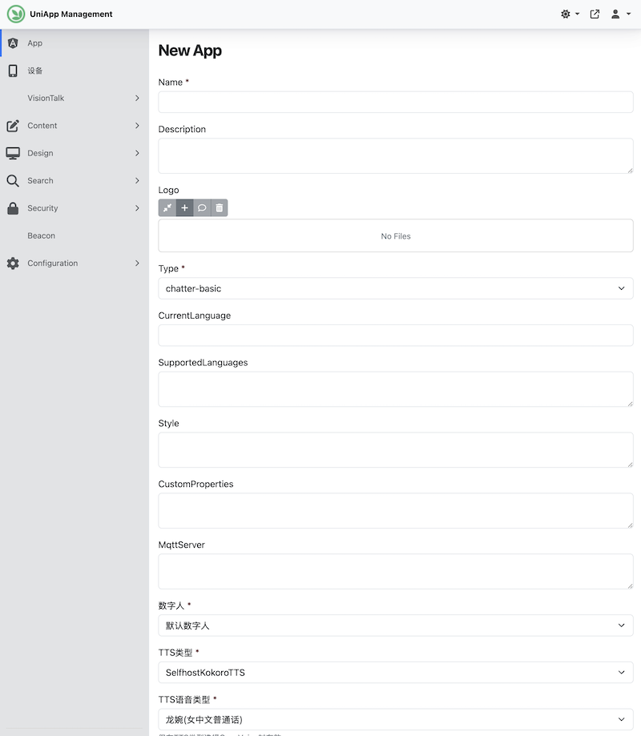
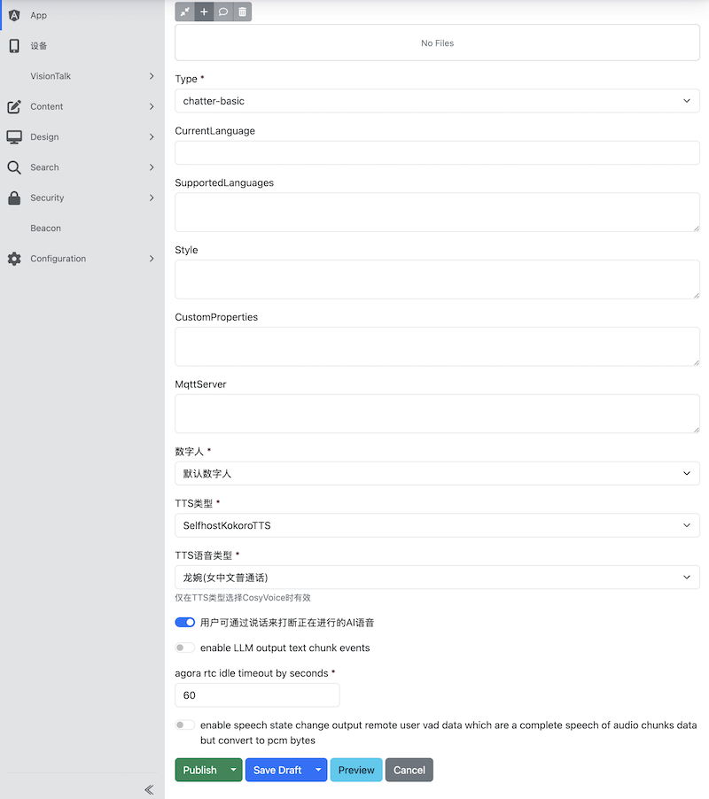
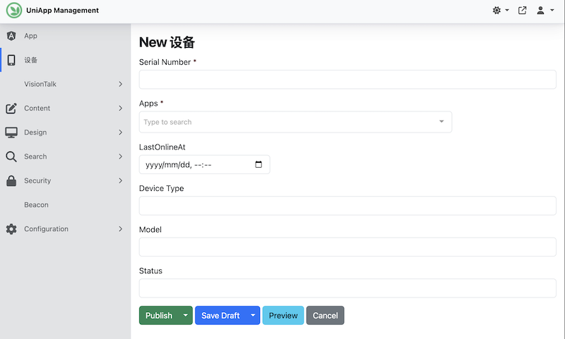

# 后台管理指南

## 后台管理地址
https://cloud.uniapp.visitpark.cn/admin

用户名: kmdev
密码: Km@123

## 应用程序管理

* 添加应用程序， 标记星号的为必填，其它可选

* 设置数字人和运行参数

选择TTS声音类型的时候需要注意：这里没有根据TTS类型进行自动关联，TTS声音类型的名称能看出是哪一个TTS类型，需要选择对应的类型

## 设备管理

* 添加设备, 标记星号的为必填，其它可选
* 重点是选择当前设备使用的App

