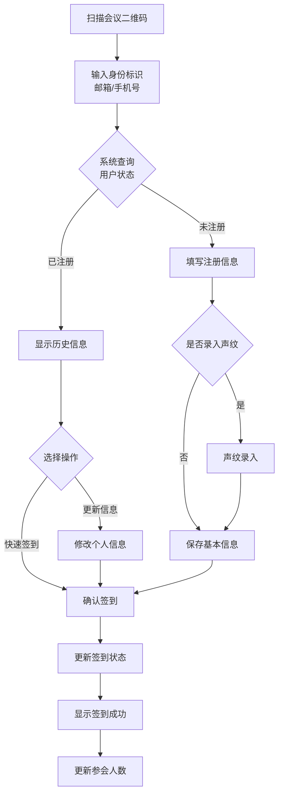
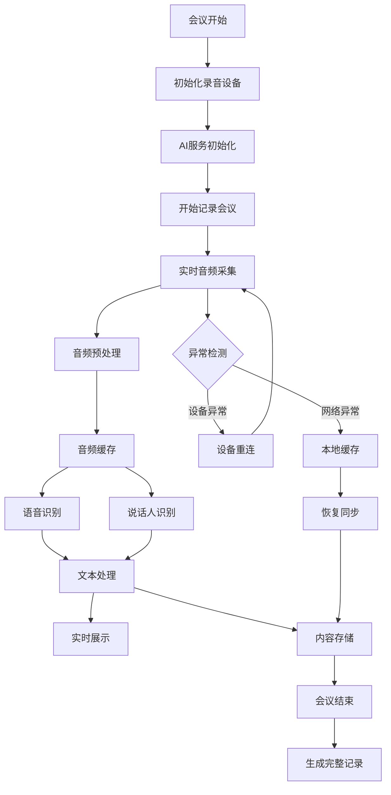
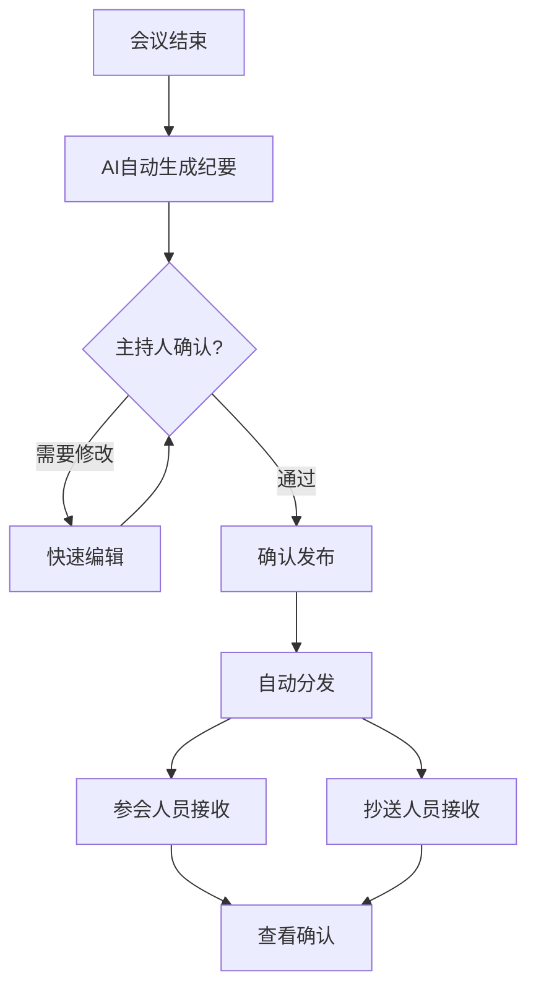

# AI会议记录系统核心功能设计

## 系统架构概述

### 整体架构
- **Web后端系统**：会议管理、AI处理、数据存储
- **语音采集终端**：语音采集、实时显示、二维码显示
- **AI服务**：语音识别、说话人识别、内容摘要

---

## 核心功能模块

### 1. 会议管理模块
#### 1.1 会议基本信息管理
- **会议基本信息**
  - 会议主题
  - 会议时间
  - 会议地点
  - 会议类型

- **参会人员管理**
  - 参会者添加（姓名、邮箱）
  - 参会者签到管理
  - 现场扫码注册管理

#### 1.2 会议纪要管理
- **接收人管理**
  - 主要接收人列表
  - 抄送人列表
  - 邮件发送配置

### 2. 会议现场注册模块
#### 2.1 二维码管理
- **二维码生成**
  - 会议唯一标识码
  - 动态二维码生成
  - 二维码有效期控制

#### 2.2 现场注册流程
- **参会者注册**
  - 扫码填写基本信息（姓名、邮箱等）
  - 可选声纹录入
  - 注册确认

#### 2.3 终端显示
- **信息展示**
  - 会议基本信息显示
  - 二维码显示
  - 注册引导提示
  - 实时参会人数显示

### 3. 音频处理模块
#### 3.1 语音采集
- **核心采集功能**
  - 音频采集与存储
  - 基础降噪处理
  - 音频质量监控

#### 3.2 实时处理
- **音频预处理**
  - 噪声抑制
  - 音频格式转换
  - 实时上传

### 4. AI处理模块
#### 4.1 语音识别
- **语音转文字**
  - 实时语音识别
  - 文本校对功能
  - 专业词汇识别

#### 4.2 说话人识别
- **基础声纹识别**
  - 参会者声纹录入
  - 说话人识别
  - 发言人标记

#### 4.3 内容处理
- **会议纪要生成**
  - 关键内容提取
  - 会议要点总结
  - 重要决策提取

### 5. 会议纪要输出
#### 5.1 纪要生成
- **内容整理**
  - 会议基本信息
  - 参会人员信息
  - 会议主要内容
  - 重要决议事项

#### 5.2 发送分发
- **自动发送**
  - 邮件发送
  - 发送状态跟踪
  - 基本格式化处理

## 业务流程

### 1. 会议注册

### 3.2 会议记录流程

### 会议纪要生成和发送

## 数据安全
### 基础安全保障
- 音频数据加密存储
- 基本访问权限控制
- 敏感信息保护
- 二维码有效期控制
