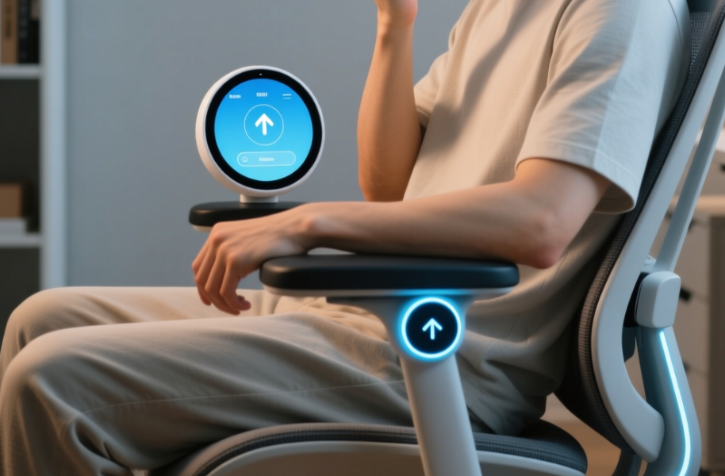
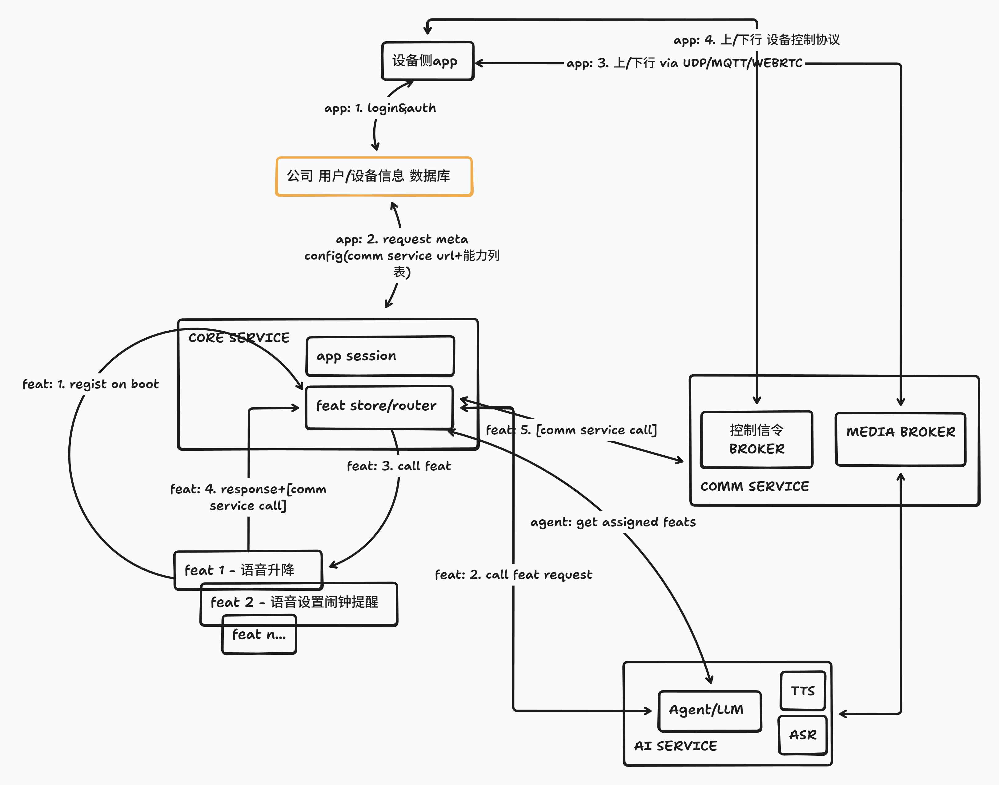

# AI座椅
用 `AI语音/智能体/长记忆`技术赋能电动办公座椅, 让办公座椅更懂用户需求, 提升办公体验.

## 背景
现有的高级电动办公座椅, 通常具备多种电动调节功能, 如靠背角度, 座椅高度, 腰部支撑, 按摩等.
但用户需要通过手动操作按钮或旋钮来调整这些功能, 使用体验不佳.    
通过引入AI语音助手, 用户可以通过自然语言与座椅交互, 例如说"帮我调高座椅"或"启动按摩功能".    
AI语音助手可以理解用户的意图, 并将其转换为具体的座椅控制命令, 提供更便捷的操作方式.

## 技术架构
架构图如下:

> 打造一个完整的AI座椅解决方案, 围绕`能力商店`的概念来打造座椅能力进化的技术和新商业模式平台.
### 设备侧
* 用户身份识别模块
    身份代码输入?
* 语音收集与播放
    热词唤醒, 或者触发按钮进行语音收集
* 传感器数据采集
    供后台AI智能体更好的理解用户状态
* 电控接口
    供后台AI智能体下发控制命令

### 管理后端服务
* 用户身份管理
    识别用户身份, 关联用户偏好设置
* 用户偏好学习
    基于用户历史操作数据, 学习用户的座椅调节偏好
* 能力中心
    如座椅升降, 按摩等能力的实现, 供AI智能体调用
* 用户操作界面
    用户可以通过手机APP或网页界面, 查看和调整座椅设置
### AI后端服务
* 语音识别
* 语音合成
* 自然语言理解
* 智能体引擎
    结合用户偏好和当前环境, 生成座椅控制命令

## 产品原型阶段实施步骤
以最简化的功能集为目标, 暂不考虑用户身份, 长记忆等功能, 快速实现产品原型.
### 设备侧
* WIFI, MIC, SPEAKER, TP, 显示等模组
* HTTP/MQTT通信库
* 语音编码与解码库, OPUS/PCM
### 管理后端服务
不做用户身份管理和偏好学习, 仅实现几个优先级高的能力.
高优先级能力: 座椅升降, 靠背调节, 按摩等??
### AI后端服务
集成高优先级能力到智能体.
