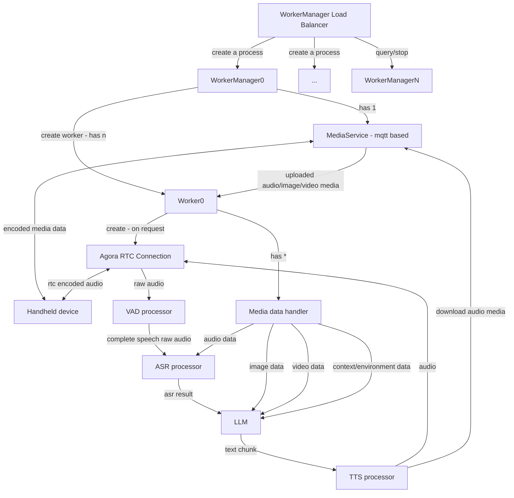

# MQTT RPC specification
rpc involves a **request-response-event** model, and 2 or more peers can communicate with each other through predefined topics and messages.    
`inbox` is used for request-response, and `events` is used for event broadcasting.
## `request` format
```json
{
  "type": "request",
  "action": "<action_name>",
  "sender": "<sender_identifier>",
  "id": "<unique_request_id>",
  "ts": "<timestamp>",
  "response_topic": "<response_topic>",
  "body": {
    // action-specific parameters
  }
}
```
## `response` format
```json
{
  "type": "response",
  "action": "create_worker_and_start",
  "sender": "agora_ai_service_agora_worker_manager",
  "id": "832546cd-3e9a-4fd7-abaa-494de5ca33d7",
  "ts": "2025-04-01T01:51:30.539491+00:00",
  "status_code": 200,
  "body": {
    // action-specific parameters
}
```
## `event` format
```json
{
  "type": "event",
  "action": "speech_state",//also could be multi-level like " by_sessions/worker119119/speech_state"
  "sender": "agora_ai_service_agora_worker_manager",
  "id": "281788ee-c60e-4f4b-8df0-2c70543a6ae1",
  "ts": "2025-04-01T01:53:22.477389+00:00",
  "body": {
    // action-specific parameters
  }
}
```
# Visitpark AI Service

A service that manages workers for dual-way communication, now support `Agora RTC connection`, `walkie-talkie via mqtt`.
There're 3 levels of the service:
* Worker    
real worker that handles the actual tasks, such as `Agora RTC connection`, `walkie-talkie via mqtt`, etc.
* Worker Manager    
each worker manager holds multiple workers, and manages the workers' lifecycle.    
each worker manager is a `mqtt rpc` client, and can communicate with other peers through `mqtt rpc` protocol.
* WorkerManager Load Balancer    
most likely only one instance of Load Balancer is running in one machine.
used to create system process for hold worker managers.    
each process holds a single instance of `WorkerManager`.     
Load Balancer itself is a `mqtt rpc` client, and can communicate with other peers through `mqtt rpc` protocol.


## WorkerManager Load Balancer
key topics refer below:

```
self.public_rpc = mqtt_rpc.MQTTRPC(
    host=public_mqtt_rpc_config.get("broker"),
    port=int(public_mqtt_rpc_config.get("port", 1883)),
    username=public_mqtt_rpc_config.get("user_name"),
    password=public_mqtt_rpc_config.get("password"),
    sender_name=f"visitpark_ai_service_worker_manager_load_balancer_{self.name}",
    local_inbox_topic=public_mqtt_rpc_config.get(
        "local_inbox_topic", f"rpc/visitpark_ai_service/worker_manager_load_balancer/{self.name}/inbox"),
    local_event_base_topic=f"rpc/visitpark_ai_service/worker_manager_load_balancer/{self.name}/events")
```
variable `self.name` default set to: `0`
### Supported Requests
1. create_worker_manager_process    
    create a new process with an instance of `WorkerManager` in it.    
    - Required parameters:
        - `worker_manager_name`: Name of the worker manager, must unique worldwide, will be used as part of the worker manager's `mqtt rpc` topic.    
    - Sample inbox topic:
        ```
        rpc/visitpark_ai_service/worker_manager_load_balancer/0/inbox
        ```
    - Sample request:
        ```json
        {
            "type": "request",
            "action": "create_worker_manager_process",
            "sender": "local shao dev-machine",
            "id": "832546cd-3e9a-4fd7-abaa-494de5ca33d7",
            "ts": "2019-07-04T13:33:03.969Z",
            "response_topic": "dev_debug_cust_service_rpc_response",
            "body": {
                "worker_manager_name": "worker_manager_dev_test_purpose",
            }
        }
        ```
2. query_worker_manager_process    
    list the processes of `WorkerManager` created by the load balancer.
    Optional parameters:
        - `worker_manager_name`: Name of the worker manager, omit it will list all the processes.
3. stop_worker_manager_process    
    stop the process of `WorkerManager` created by the load balancer.
    Required parameters:    
    - `worker_manager_name`: Name of the worker manager.
## WorkerManager
### Control command Service
for control command purpose topic is:
```
rpc/visitpark_ai_service/worker_manager/{self.name}/inbox
```
variable `self.name` is set to `worker_manager_name` from the `load balancer`'s rpc: `create_worker_manager_process` request.
#### Supported Requests

1. create_worker_and_start    
    Creates and starts a new worker
    Required parameters:
    - `device_serial_no`: user side handheld device serial number
    - `worker_id`: Custom worker ID
    Optional parameters:
    - `runtime_config`: Full Runtime configuration
     
    Sample:
    ```json
    {"type":"request",
        "action":"create_worker_and_start",
        "sender":"local shao dev machine",
        "id":"832546cd-3e9a-4fd7-abaa-494de5ca33d7",
        "ts":"2019-07-04T13:33:03.969Z",
        "response_topic":"dev_debug_agora_cust_service_rpc_response",
        "body":{
          "worker_id":"worker119119",
          "device_serial_no":"adferefsdf1129jsdfi", 
        }
    ```
    }
2. start_agora_rtc_conn      
    Starts the Agora RTC connection for a worker
    Required parameters:
    - `worker_id`: ID of the worker
    - `agora_channel_name`: Agora channel name
    - `agora_app_id`: Agora app ID

    Optional parameters:
    - `agora_token`: Agora token, optional, if not provided, will use the default token
    - `agora_local_user_uid`: the worker run as a agora local user, this id will used to join the channel, leave 0 or empty will get a random value from agora system. 
3. **stop_agora_rtc_conn**    
    Stops the Agora RTC connection for a worker
    - Required parameters:
      - `worker_id`: ID of the worker

4. **stop_worker_and_release**    
  Stops and releases a worker
    - Required parameters:
      - `worker_id`: ID of the worker to stop

5. **update_worker_runtime_config**    
  Updates a worker's runtime config, 可发送全量或者部分配置
   - Required parameters:
     - `worker_id`: ID of the worker
     - `runtime_config`: New runtime config,可以是全量,也可以是部分,如果是部分,则需要指定`is_full_update`为false
       - `enable_interrupt_ongoing_speech_with_new_speech`: Boolean to enable 用户可通过说话来打断正在进行的AI语音, 默认值为false.
           > 注意, 即对RTC模式下的实时语音有效,对讲机模式下则无效, 因为对讲机模式下的语音打断需要配合设备侧来实现,暂不支持.

       - `use_tts_type`: 指定使用什么类型的TTS引擎: [`"AliyunCosyVoiceV1TTS"`, `"SelfhostKokoroTTS"`, `"SelfhostF5TTS"`], default is `"SelfhostKokoroTTS"`
       - `use_tts_speaker_voice`: 指定使用的声音,每个不同的TTS引擎都有不同的声音, 阿里云CosyVoiceV1TTS 引擎有: 
          
          > full list: https://bailian.console.aliyun.com/?tab=model#/efm/model_experience_center/voice?currentTab=voiceTts
          
          ```
          longwan - 女中文普通话, 龙婉声音温柔甜美，富有亲和力，给人温暖陪伴感。
          longcheng - 男中文普通话, 龙橙声音温柔清澈，富有亲和力，是邻家的温暖大哥哥。
          longxiaochun -(默认) 女中英双语, 龙小淳的嗓音如丝般柔滑，温暖中流淌着亲切与抚慰，恰似春风吹过心田。
          longyue - 女中文普通话, 龙悦以抑扬顿挫、韵味十足的评书腔调，生动讲述故事，引领听众步入传奇世界！
          longlaotie - 男东北口音, 龙老铁以纯正东北腔，豪爽直率，幽默风趣，为讲述增添浓郁地方特色与生活气息。
          ```
       - `use_asr_type`: 指定使用什么类型的ASR引擎: [`"SelfhostSenseVoiceSmall"`, `"AliyunCompleteSpeechAsr"`], default is `"SelfhostSenseVoiceSmall"`, `AliyunCompleteSpeechAsr`将使用阿里云的基于模型`paraformer-realtime-v2`的公开服务, 速度较慢, 平均延迟在1000ms左右, 但效果较好, 而且支持热词表.
       - `agora_rtc_idle_timeout_by_seconds`: only for agora rtc conn started worker, controls how long the rtc conn will be kept alive after it is idle, default is 60, after this time, the worker manager will actively stop the agora rtc conn and release the rtc related resources, other functions will not be affected.
       - `user_environmental_description`: String to describe the user environment, default NONE, 长度有限制, 默认512. 此string将作为context送到LLM中, 让LLM知道用户的环境, 例如: "用户的名字叫AA,他于今天即3月11日早上9:15分入园, 他在9:20分坐上了班车,......"
       - `dify_llm_endpoint_api_key`: 每个worker中将初始化一个dify client去与dify server中人工预配置和定义好的 `agent/workflow` 进行交互, 这个api key就是指向这个`agent/workflow`的标识, 请到dify web中进行相应查看. 比如,`文化园A`和`文化园B`的`讲解员数字人`则肯定分别对应了不同的`agent/workflow`, 这个api key就是用来区分和指定它们的,如果不提供,则将使用本地配置文件中的默认值.
           > 注意, 此配置仅在start worker时传入有效, 对于已经创建的worker不再生效.

       - `use_agora_internal_vad_service_with_parameters_ctor`: 启用`agora server SDK`中的内置`vad`组件(则其它VAD不再启用,例如`self host`的开源的`SileroVad`),并提供指定的参数, 这个参数用于控制vad在不同环境噪音下的灵敏度, 需要传入string类型的值, 示例: `"16, 30, 50, 0.7, 0.5, 70, 70, -50"`,以下是官方说明和建议:
          ```
            # For not-so-noisy environments, use this configuration: (16, 30, 50, 0.7, 0.5, 70, 70, -50) 
            # For noisy environments, use this configuration: (16, 30, 50, 0.7, 0.5, 70, 70, -40)  
            # For high-noise environments, use this configuration: (16, 30, 50, 0.7, 0.5, 70, 70, -30)
          ```
          > **注意** 必须在启用agora RTC之前提供此runtime_config,因为此参数只在初始化agora RTC Conn的时候进行应用一次.
          > 否则需要关闭当前活跃的agora RTC Conn, 然后再重新启用.
   - Optional parameters:
      - `is_full_update`: 默认为bool值:`True`, 否则仅更新本次传入的配置项, 其他的配置项不变
6. **start_worker_speak**    
  Makes a worker start speaking text, if agora rtc conn is started, the voice (text process by a TTS) will be sent to the agora rtc conn, otherwise, the voice will be sent to the media service topic(对讲机模式). 
   - Required parameters:
     - `worker_id`: ID of the worker
     - `text`: Text to speak

6. **stop_worker_speak**    
  Stops a worker from speaking
   - Required parameters:
     - `worker_id`: ID of the worker

7. **get_active_workers**    
  Returns information about all active workers
   - No parameters required
8. **stop_worker_and_release**    
  Stops and releases a worker
   - Required parameters:
     - `worker_id`: ID of the worker to stop
9. **stop**    
  Stops the worker manager
   - No parameters required
#### Supported Events

`worker`的事件都将发送到`rpc/visitpark_ai_service/worker_manager/{wm_name}/worker_events/f"by_sessions/{worker_id}/{event_type}"`主题下.  
关于`worker`的`event type`包括:

##### `agora rtc conn`的状态变化  
以下示例为`worker`去连接`agora`服务器端的`rtc conn`所`raise`的第一个事件`rtc_conn__on_connecting`,代表正在连接中,但**还未连接成功**:
`event topic`: `rpc/visitpark_ai_service/worker_manager/{your_name}/events/by_sessions/worker119119/rtc_conn__on_connecting`

```json
{
  "type": "event",
  "action": "by_sessions/worker119119/rtc_conn__on_connecting",
  "sender": "ai_service_worker_manager",
  "id": "632fedd6-70f9-436a-be2a-3e88fcd7681c",
  "ts": "2025-03-31T12:30:56.443334+00:00",
  "body": {
    "worker_id": "worker119119",
    "local_user_id": "0",
    "state": 2,
    "internal_uid": 0,
    "reason": 0,
    "reason_str": "建立网络连接中"
  }
}
```

以下是`agora rtc`正式连接成功后的事件`rtc_conn__on_connected`,代表连接成功,也可以看到`local_user_id`被获取到了,这就是`worker`作为`agora local user`的身份加入了频道:
`Topic: rpc/visitpark_ai_service/worker_manager/{your_name}/events/by_sessions/73959/rtc_conn__on_connected`

```json
{
  "type": "event",
  "action": "by_sessions/73959/rtc_conn__on_connected",
  "sender": "ai_service_agora_worker_manager",
  "id": "12302f7f-fcce-4590-83f0-3c1dc01723c9",
  "ts": "2025-04-01T01:53:20.485907+00:00",
  "body": {
    "worker_id": "73959",
    "local_user_id": "96612798",
    "state": 3,
    "internal_uid": 0,
    "reason": 1,
    "reason_str": "成功加入频道"
  }
}
```

接下来可以看到真人用户的加入事件,也可以看到`remote_user_id`也被获取到了,这就是`agora remote user`即真人用户加入频道成功的事件:
`Topic: rpc/visitpark_ai_service/worker_manager/{your_name}/events/by_sessions/worker119119/rtc_conn__on_user_joined`

```json
{
  "type": "event",
  "action": "by_sessions/worker119119/rtc_conn__on_user_joined",
  "sender": "ai_service_worker_manager",
  "id": "13d21167-6148-4814-a92d-82d261ece722",
  "ts": "2025-04-01T01:53:22.473090+00:00",
  "body": {
    "worker_id": "worker119119",
    "remote_user_id": "3852645739"
  }
}
```

还包括`on_user_joined`, `on_user_left`等事件可以知道真人用户即`agora remote user`(或者本`worker`作为`agora local user`)是否加入或离开了频道

##### `agora user`与`agora channel`的状态变化  
  包括`audio track`事件(用户是否开始收音频), `user info`等的状态和数据的变化

`Topic: rpc/visitpark_ai_service/worker_manager/{your_name}/events/by_sessions/worker119119/local_user_observer__on_user_info_updated`    

```json
{
  "type": "event",
  "action": "by_sessions/71975/local_user_observer__on_user_info_updated",
  "sender": "ai_service_worker_manager",
  "id": "d936229d-ccd5-400c-addb-8e534263d54c",
  "ts": "2025-04-03T02:12:08.235468+00:00",
  "body": {
    "worker_id": "71975",
    "user_id": "2264375541",
    "msg": 1,
    "readable_msg_str": "\u7528\u6237\u5df2\u7ecf\u505c\u6b62\u53d1\u5e03\u89c6\u9891\u6d41",
    "val": 0,
    "readable_val_str": "\u7528\u6237\u662f\u5426\u505c\u6b62\u53d1\u6d41: \u4e0d\u505c\u6b62\u53d1\u6d41"
  }
}
```

`Topic: rpc/visitpark_ai_service/worker_manager/{your_name}/events/by_sessions/worker119119/local_user_observer__on_user_audio_track_state_changed`    
```json
{
  "type": "event", 
  "action": "by_sessions/71975/local_user_observer__on_user_audio_track_state_changed", 
  "sender": "ai_service_worker_manager", 
  "id": "771665ab-df8e-4a6b-9bdc-878461a838f5", 
  "ts": "2025-04-03T02:12:08.391320+00:00", 
  "body": 
  {
    "worker_id": "71975", 
    "remote_user_id": "2264375541", 
    "state": 1, 
    "readable_state_str": "Unmuted", 
    "reason": 6, 
    "readable_reason_str": "Unmuted by self", 
    "elapsed": 17019
  }
}

```


##### speech_state_change
目前仅有agora remote user即真人用户的说话的状态.
真人用户开始说话, 即由VAD检测到人声开始
```json
{
  "type": "event",
  "action": "by_sessions/71975/speech_state_change",
 "sender": "ai_service_worker_manager",
 "id": "d936229d-ccd5-400c-addb-8e534263d54c",
 "ts": "2025-04-03T02:12:08.235468+00:00",
 "body": {
    "state": "speech_start", "speech_id": "speech_id_123456",# 这个在每段完整对话开始时由系统唯一分配, "user": {"src": "agora_remote_user"}
 }
}
```
真人用户的一段说话结束, 即由VAD检测到人声结束
```json
{
  "type": "event",
  "action": "by_sessions/71975/speech_state_change",
  "sender": "ai_service_worker_manager",
  "id": "d936229d-ccd5-400c-addb-8e534263d54c",
  "ts": "2025-04-03T02:12:08.235468+00:00",
  "body": {
    "state": "speech_end", "speech_id": speech_id, "user": {"src": "agora_remote_user"}
  }
}
```
如果开启了runtime config中的`enable_public_speech_state_change_event_output_remote_user_vad_data`,则上述事件会包含此段完整说话的原始pcm音频数据
```json
{
  "type": "event",
  "action": "by_sessions/71975/speech_state_change",
  "sender": "ai_service_worker_manager",
  "id": "d936229d-ccd5-400c-addb-8e534263d54c",
  "ts": "2025-04-03T02:12:08.235468+00:00",
  "body": {
    "state": "speech_end", "speech_id": speech_id,
    "complete_speech_pcm_bytes": "base64_bytes_str", #这里是pcm音频数据的base64编码
    "user": {"src": "agora_remote_user"}
  }
}
```
接下来, 会将上述的真人完整的一段说话进行asr处理,即识别其中的文字内容,当asr结束后, 以下事件将触发
```json
{
  "type": "event",
  "action": "by_sessions/worker119119/speech_state_change",
  "sender": "ai_service_worker_manager",
  "id": "d936229d-ccd5-400c-addb-8e534263d54c",
  "ts": "2025-04-03T02:12:08.235468+00:00",
  "body": {
    "state": "speech_asr_process_done",
    "speech_id": speech_id,
    "asr_result": "<aa><bb>|hello world",
    "plain_asr_result": hello world,
    "asr_used_time_by_ms": 1234
  }
}
```
接下来, 会将上述的asr文字输入到LLM中,然后等待LLM输出, 如果启用了runtime_config 中的`enable_public_speech_state_change_event_output_llm_streaming_output_data`,以下事件才会触发,而且是每次LLM流式输出都会触发此事件:
```json
{
  "type": "event",
  "action": "by_sessions/worker119119/speech_state_change",
  "sender": "ai_service_worker_manager",
  "id": "d936229d-ccd5-400c-addb-8e534263d54c",
  "ts": "2025-04-03T02:12:08.235468+00:00",
  "body": {
    "state": "llm_output_text",
    "speech_id": speech_id,
    "text_chunk": text_chunk,
    "is_last_chunk": is_last_chunk
  }
}
```
##### `life_cycle_state_change` for worker_manager
 when stop the worker manager, `Topic: rpc/visitpark_ai_service/worker_manager/{your_name}/events/life_cycle_state_change`
    ```
    {"state": "stopping"}
    ```
    ```
    {"state": "stopped"}
    ```
 - `life_cycle_state_change` for worker
  when stop the worker, `Topic: rpc/visitpark_ai_service/worker_manager/{your_name}/events/by_sessions/worker119119/life_cycle_state_change`
    ```
    {"state": "stopping"}
    ```
    ```
    {"state": "stopped"}
    ```
### Media Service
分为上传和下载两个部分, 而且media服务的服务器终端都是worker,所以topic中需要指定`worker_id`.
上传(设备端上传资源到本服务)的主题是:
```
rpc/visitpark_ai_service/worker_manager/{self.name}/media_upload/by_sessions/{worker_id}/media_type/{your_meida_type}
```
variable `self.name` is set to `worker_manager_name` from the `load balancer`'s rpc: `create_worker_manager_process` request.
variable `worker_id` is the target worker's `worker_id` of the worker that will receive the media.
variable `your_media_type` is the type of media, such as `audio_opus`, `video`, `image`, etc.

下载(本服务下载资源到设备端,设备再播放此资源)的主题是:
```
rpc/visitpark_ai_service/worker_manager/{self.name}/media_download/by_sessions/{worker_id}/media_type/{your_meida_type}
```
variable `self.name` is set to `worker_manager_name` from the `load balancer`'s rpc: `create_worker_manager_process` request.
variable `worker_id` is the target worker's `worker_id` of the worker that will receive the media.
variable `your_media_type` is the type of media, such as `audio_opus`, `video`, `image`, etc.
#### Supported Requests
* **upload audio data with opus format**    
    设备上传完整的一段音频到服务器端的worker
    设备publish的sample topic is: `'rpc/visitpark_ai_service/worker_manager/dev/media_upload/by_sessions/dev_worker/media_type/audio_opus'`
    worker会订阅这个主题,并进行处理.

    Sample request json:
    ```json
    {
            "type": "event",
            "action": "upload_media",
            "body": {
                "media_type": "audio_opus", 
                "data": ["V5KFGJ/JOXaA...", "ugn32Wst/VCW0no", "8G/vubMvS7osOA==",  "WQHyXnI2kvv7KyA="],
                "speech_id": "speech_id_123456", # 可选, 由上传方指定,之后的下载音频数据会包含此字段,
            }
    }
    ```
    `data`必须是数组,其中的元素是源音频(一般是.pcm的音频数据)经过`opus`编码后的各个opus音频帧.
    我在测试时, 在进行opus对pcm音频进行编码时,使用的帧时间长度的参数是120ms, 这代表着每个opus音频帧将包含120ms的音频内容.
* **upload audio data with pcm format**    
    设备上传完整的一段音频到服务器端的worker
    sample rate 16000, 16bit, mono
    设备publish的sample topic is: `'rpc/visitpark_ai_service/worker_manager/dev/media_upload/by_sessions/dev_worker/media_type/audio_pcm'`
    worker会订阅这个主题,并进行处理.

    Sample request json:
    ```json
    {
            "type": "event",
            "action": "upload_media",
            "body": {
                "media_type": "audio_pcm", 
                "data": "V5KFGJ/JOXaA...",
                "speech_id": "speech_id_123456", # 可选, 由上传方指定,之后的下载音频数据会包含此字段,
            }
    }
    ```
    
* **download audio data with opus format**    
    服务器的worker下载音频到设备端
    设备应该要下载此音频数据, 这个音频数据是经过`opus`编码的, 需要在设备端进行解码.
    设备订阅的sample topic is: `rpc/visitpark_ai_service/worker_manager/dev/media_download/by_sessions/dev_worker/media_type/audio_opus`
    Sample request json:
    ```json
    {"type": "event", "action": "media_download",  
    "body": {
      "state": "llm_response_tts_opus_bytes_produced", 
      "data": [...]}}
    ```
    `data`必须是数组,其中的元素是源音频(一般是.pcm的音频数据)经过`opus`编码后的各个opus音频帧.
    我在测试时, 在进行opus对pcm音频进行编码时,使用的帧时间长度的参数是120ms, 这代表着每个opus音频帧将包含120ms的音频内容.
* **download audio data with pcm format**    
    服务器的worker下载音频到设备端
    设备订阅的sample topic is: `rpc/visitpark_ai_service/worker_manager/dev/media_download/by_sessions/dev_worker/media_type/audio_pcm`
    Sample request json:
    ```json
    {"type": "event", "action": "media_download",  
    "body": { 
      "state": "llm_response_tts_opus_bytes_produced", 
      "pcm_data": "V5KFGJ/JOXaA..."}}
    ```
    `pcm_data`是pcm的音频数据经过`base64`编码的string.
* **upload image data**    
    设备上传图片到服务器端的worker
    设备publish的sample topic is: `'rpc/visitpark_ai_service/worker_manager/dev/media_upload/by_sessions/dev_worker/media_type/image'`
    worker会订阅这个主题,并进行处理.

    Sample request json,以下示例中上传了4张图片:
    ```json
    {"type": "event", 
    "action": "media_upload", 
    "sender": "shao_local_dev_media", 
    "id": "1e3b5643-6cc6-45d2-808e-b14a108b7887", 
    "ts": "2025-04-30T06:30:34.197411+00:00", 
    "body": {
      "media_type": "image",
      "data": ["V5KFGJ/JOXaA...", "ugn32Wst/VCW0no", "8G/vubMvS7osOA==",  "WQHyXnI2kvv7KyA="],
      "speech_id": "speech_id_123456", # 可选, 由上传方指定,之后的下载音频数据会包含此字段,
    }
    }
    ```
    `data`必须是数组,其中的元素是图片经过`base64`编码后的各个图片数据.

* **download image data**    
    服务器端发送一张或者多张图片给设备端, 设备端应该下载并显示
    设备端subscribe的sample topic is: `'rpc/visitpark_ai_service/worker_manager/dev/media_download/by_sessions/dev_worker/media_type/image'`

    Sample request json,以下示例中下载2张图片,并且都有`text`字段, 这个字段是对图片的描述, 设备端可以显示:
    ```json
    {"type": "event", 
    "action": "media_download", 
    "sender": "shao_local_dev_media", 
    "id": "1e3b5643-6cc6-45d2-808e-b14a108b7887", 
    "ts": "2025-04-30T06:30:34.197411+00:00", 
    "body": {
      "media_type": "image",
      "data": [ 
        {"image":"V5KFGJ/JOXaA...", "text":"这张图片是一颗树"}, 
        {"image": "ugn32Wst/VCW0no....", "text":"这张图片是一个人"}
        ],
      "speech_id": "speech_id_123456", # 可选, 由上传方指定,之后的下载的数据即会包含此字段,
    }
    }
    ```
    `data`必须是数组,其中的元素是图片经过`base64`编码后的.jpg格式的图片数据.

