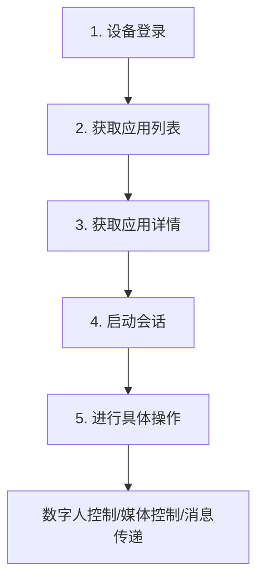

# Uniapp API 前端开发者文档

## 简介

Uniapp API 是一个用于设备管理和会话控制的云端API服务，主要用于数字人交互、媒体控制和消息通信。

通过接口1.4获取租户API地址

GET https://cloud.uniapp.visitpark.cn/v1/uniapp/tenant/devices?serial_no=xxxx


**基础信息：**
- API版本：v1
- 基础URL：`https://cloud.uniapp.visitpark.cn`
- 认证方式：Bearer Token
- 内容类型：`application/json`

## 认证

所有API请求都需要在请求头中包含访问令牌：

```javascript
headers: {
  'Authorization': 'Bearer YOUR_ACCESS_TOKEN',
  'Content-Type': 'application/json'
}
```

## API调用流程

在开始使用Uniapp API之前，请按照以下流程进行API调用：

### 标准调用流程




### 详细步骤说明

#### 步骤1：设备登录获取AccessToken
```javascript
// 调用设备登录接口
const loginResponse = await fetch('/v1/uniapp/devices/login', {
  method: 'POST',
  headers: {
    'Content-Type': 'application/json'
  },
  body: JSON.stringify({
    serial_no: 'YOUR_DEVICE_SERIAL'
  })
});

const loginData = await loginResponse.json();
const accessToken = loginData.access_token;

// 保存AccessToken供后续使用
localStorage.setItem('uniapp_token', accessToken);
```

#### 步骤2：获取设备支持的应用列表
```javascript
// 使用AccessToken获取应用列表
const appsResponse = await fetch('/v1/uniapp/devices/app-list', {
  method: 'GET',
  headers: {
    'Authorization': `Bearer ${accessToken}`,
    'Content-Type': 'application/json'
  }
});

const appsData = await appsResponse.json();
console.log('可用应用:', appsData.apps);
```

#### 步骤3：获取特定应用的详细信息
```javascript
// 选择要使用的应用ID
const selectedAppId = appsData.apps[0].app_id;

// 获取应用详情
const appInfoResponse = await fetch(`/v1/uniapp/devices/app-info?app_id=${selectedAppId}`, {
  method: 'GET',
  headers: {
    'Authorization': `Bearer ${accessToken}`,
    'Content-Type': 'application/json'
  }
});

const appInfo = await appInfoResponse.json();
console.log('应用详情:', appInfo);
```

#### 步骤4：启动AI会话
```javascript
// 启动与AI的会话
const sessionResponse = await fetch('/v1/uniapp/sessions/start', {
  method: 'POST',
  headers: {
    'Authorization': `Bearer ${accessToken}`,
    'Content-Type': 'application/json'
  },
  body: JSON.stringify({
    app_id: selectedAppId,
    options: {
      // 可选的会话配置参数
    }
  })
});

const sessionData = await sessionResponse.json();
const sessionId = sessionData.session_id;

// 保存SessionID供后续操作使用
localStorage.setItem('current_session_id', sessionId);
console.log('会话已启动，SessionID:', sessionId);
```

## API 端点

### 1. 设备管理 (Devices)

#### 1.1 设备登录
登录设备并获取访问令牌。

**请求：**
```
POST /v1/uniapp/devices/login
```

**请求体：**
```json
{
  "serial_no": "设备序列号"
}
```

**响应：**
```json
{
  "access_token": "访问令牌",
  "expires_in": 3600,
  "serial_no": "设备序列号"
}
```

**JavaScript 示例：**
```javascript
const loginDevice = async (serialNo) => {
  const response = await fetch('/v1/uniapp/devices/login', {
    method: 'POST',
    headers: {
      'Content-Type': 'application/json'
    },
    body: JSON.stringify({
      serial_no: serialNo
    })
  });

  return await response.json();
};
```

#### 1.2 获取应用信息
根据应用ID获取应用详细信息。

**请求：**
```
GET /v1/uniapp/devices/app-info?app_id={app_id}
```

**参数：**
- `app_id` (必需): 应用ID

**响应：**
```json
{
  "app_id": "应用ID",
  "app_name": "应用名称",
  "app_logo": "应用logo URL",
  "app_type": "应用类型",
  "current_language": "zh-CN",
  "app_description": "应用描述",
  "supported_languages": ["zh-CN", "en-US"],
  "style": {
    "primary_color": "#007bff",
    "secondary_color": "#6c757d",
    "background_color": "#ffffff"
  },
  "mqtt_server": {
    "ws_endpoint": "wss://mqtt.example.com",
    "ws_port": 8083
  }
}
```

#### 1.3 获取应用列表
获取设备上安装的应用列表。

**请求：**
```
GET /v1/uniapp/devices/app-list
```

**响应：**
```json
{
  "apps": [
    {
      "app_id": "应用ID",
      "app_name": "应用名称",
      "app_logo": "logo URL",
      "app_type": "应用类型",
      "current_language": "zh-CN"
    }
  ]
}
```

#### 1.4 根据设备序列号获取租户接口地址

**请求**
```
GET /v1/uniapp/tenant/devices?serial_no=xxxx
```

**响应：**
```json
{
  "tenant_base_url": "https://cloud.uniapp.visitpark.cn"
}
```


### 2. 会话管理 (Sessions)

#### 2.1 启动会话
创建新的应用会话。

**请求：**
```
POST /v1/uniapp/sessions/start
```

**请求体：**
```json
{
  "app_id": "应用ID",
  "options": {
    "key": "value"
  }
}
```

**响应：**
```json
{
  "session_id": "",
  "status": "started",
  "created_at": "2025-07-12T13:57:46.2046833Z",
  "expires_at": null,
  "config": null,
  "mqtt_server": {
    "ws_endpoint": "wss://mqtt.visitpark.cn/mqtt",
    "mqtt_endpoint": "mqtt.visitpark.cn",
    "ws_port": 443,
    "mqtt_port": 1883,
    "use_secure_connection": true,
    "username": "",
    "password": "",
    "topics": {
      "modality_upward": {
        "topic": "rpc/visitpark_ai_service/worker_manager/shaoshao/modality_upward/worker/rtc_s3xh",
        "description": "",
        "qos": 0,
        "can_publish": false,
        "can_subscribe": true
      },
      "modality_downward": {
        "topic": "rpc/visitpark_ai_service/worker_manager/shaoshao/modality_downward/worker/rtc_s3xh",
        "description": "",
        "qos": 0,
        "can_publish": false,
        "can_subscribe": true
      },
      "worker_event": {
        "topic": "rpc/visitpark_ai_service/worker_manager/shaoshao/worker_event/worker/rtc_s3xh",
        "description": "",
        "qos": 0,
        "can_publish": false,
        "can_subscribe": true
      }
    },
    "client_id_prefix": "visiontalk_",
    "connection_parameters": {}
  }
}```

#### 2.2 停止会话
停止指定的会话。

**请求：**
```
POST /v1/uniapp/sessions/stop
```

**请求体：**
```json
{
  "session_id": "会话ID",
  "reason": "停止原因"
}
```

#### 2.3 获取会话历史
获取用户与AI的交互历史记录。

**请求：**
```
GET /v1/uniapp/sessions/history?session_id={session_id}&pageIndex=0&pageSize=20
```

**参数：**
- `session_id` (必需): 会话ID
- `pageIndex` (可选): 页码，默认0
- `pageSize` (可选): 每页大小，默认20

**响应：**
```json
{
  "session_id": "会话ID",
  "interactions": [
    {
      "message_id": "消息ID",
      "timestamp": "2024-01-01T00:00:00Z",
      "sender": "user",
      "content": [
        {
          "type": "text",
          "data": "用户消息内容"
        }
      ]
    }
  ],
  "total_count": 100,
  "page_index": 0,
  "page_size": 20
}
```
#### 2.4 启动RTC会话
创建新AGORA会话。

**请求：**
```
POST /v1/uniapp/sessions/start-rtc
```

**响应：**
```json
{
  "rtc_token": "",
  "channel_name": "rtc_yufy",
  "user_id": 83358744,
  "app_id": "7041fd4d0c604aca995415b5101896c6",
  "token_expires_at": "2025-07-12T15:12:06.9326084Z",
  "server_config": null
}
```

#### 2.2 停止RTC会话

**请求：**
```
POST /v1/uniapp/sessions/close-rtc
```

### 3. 推送消息接口 (Client Request)

#### 3.1 确认对话框推送

向客户端推送确认对话框，用于需要用户确认的操作场景。

**接口地址**: `POST /v1/uniapp/client/request/confirmation`

**请求体参数** (`ConfirmationDialogRequest`):

| 参数 | 类型 | 必填 | 描述 |
|------|------|------|------|
| title | string | 否 | 对话框标题 |
| content | string | 否 | 对话框内容 |
| serialNo | string | 否 | 目标设备序列号 |
| modalityContent | string | 否 | 模态内容 |
| confirmButtonText | string | 否 | 确认按钮文本，默认"确认" |
| cancelButtonText | string | 否 | 取消按钮文本，默认"取消" |

**请求示例**:

```javascript
const confirmationRequest = {
  title: "确认删除",
  content: "您确定要删除这个文件吗？此操作无法撤销。",
  serialNo: "VP2024001",
  confirmButtonText: "确认删除",
  cancelButtonText: "取消"
};

const response = await fetch('/v1/uniapp/client/request/confirmation', {
  method: 'POST',
  headers: {
    'Authorization': `Bearer ${accessToken}`,
    'Content-Type': 'application/json'
  },
  body: JSON.stringify(confirmationRequest)
});
```

#### 3.2 列表选择推送

向客户端推送列表选择界面，支持单选和多选模式。

**接口地址**: `POST /v1/uniapp/client/request/list-selection`

**请求体参数** (`ListSelectionRequest`):

| 参数 | 类型 | 必填 | 描述 |
|------|------|------|------|
| title | string | 否 | 选择列表标题 |
| content | string | 否 | 选择列表描述 |
| serialNo | string | 否 | 目标设备序列号 |
| modalityContent | string | 否 | 模态内容 |
| items | SelectionOptionData[] | 否 | 选择项列表 |
| allowMultipleSelection | boolean | 否 | 是否允许多选，默认false |

**SelectionOptionData 结构**:

| 字段 | 类型 | 描述 |
|------|------|------|
| value | string | 选项值 |
| label | string | 显示文本 |
| description | string | 选项描述 |
| icon | string | 图标名称或URL |
| disabled | boolean | 是否禁用 |

**请求示例**:

```javascript
const listSelectionRequest = {
  title: "选择服务类型",
  content: "请从以下选项中选择您需要的服务：",
  serialNo: "VP2024001",
  allowMultipleSelection: false,
  items: [
    {
      value: "consultation",
      label: "咨询服务",
      description: "提供专业咨询服务",
      icon: "question-circle",
      disabled: false
    },
    {
      value: "technical_support",
      label: "技术支持",
      description: "技术问题解答和故障排除",
      icon: "tools",
      disabled: false
    },
    {
      value: "business_process",
      label: "业务办理",
      description: "各类业务受理和办理",
      icon: "file-text",
      disabled: false
    }
  ]
};

const response = await fetch('/v1/uniapp/client/request/list-selection', {
  method: 'POST',
  headers: {
    'Authorization': `Bearer ${accessToken}`,
    'Content-Type': 'application/json'
  },
  body: JSON.stringify(listSelectionRequest)
});
```

#### 3.3 上下文操作推送

向客户端推送上下文相关的操作按钮，用于提供快捷操作入口。

**接口地址**: `POST /v1/uniapp/client/request/context-actions`

**请求体参数** (`ContextActionsRequest`):

| 参数 | 类型 | 必填 | 描述 |
|------|------|------|------|
| title | string | 否 | 操作标题 |
| content | string | 否 | 操作描述 |
| serialNo | string | 否 | 目标设备序列号 |
| modalityContent | string | 否 | 模态内容 |
| actions | ActionItem[] | 否 | 操作项列表 |

**ActionItem 结构**:

| 字段 | 类型 | 描述 |
|------|------|------|
| type | string | 操作类型 |
| label | string | 显示文本 |
| icon | string | 图标名称或URL |
| style | string | 操作样式 |
| value | string | 操作值 |
| params | object | 操作参数 |

**请求示例**:

```javascript
const contextActionsRequest = {
  title: "文档操作",
  content: "请选择对当前文档的操作：",
  serialNo: "VP2024001",
  actions: [
    {
      type: "download",
      label: "下载文档",
      icon: "download",
      style: "primary",
      value: "download_doc",
      params: {
        file_id: "doc_123456",
        format: "pdf"
      }
    },
    {
      type: "share",
      label: "分享文档",
      icon: "share",
      style: "secondary",
      value: "share_doc",
      params: {
        file_id: "doc_123456",
        share_type: "link"
      }
    },
    {
      type: "delete",
      label: "删除文档",
      icon: "trash",
      style: "danger",
      value: "delete_doc",
      params: {
        file_id: "doc_123456"
      }
    }
  ]
};

const response = await fetch('/v1/uniapp/client/request/context-actions', {
  method: 'POST',
  headers: {
    'Authorization': `Bearer ${accessToken}`,
    'Content-Type': 'application/json'
  },
  body: JSON.stringify(contextActionsRequest)
});
```

#### 3.4 通知消息推送

向客户端推送通知消息，用于状态更新、提醒等场景。

**接口地址**: `POST /v1/uniapp/client/request/notification`

**请求体参数** (`NotificationRequest`):

| 参数 | 类型 | 必填 | 描述 |
|------|------|------|------|
| title | string | **是** | 通知标题 |
| message | string | **是** | 通知内容 |
| content | string | 否 | 附加内容 |
| serialNo | string | 否 | 目标设备序列号 |
| modalityContent | string | 否 | 模态内容 |

**请求示例**:

```javascript
const notificationRequest = {
  title: "任务完成",
  message: "您的文档处理任务已成功完成。",
  content: "文档已保存到您的文件夹中，您可以随时查看。",
  serialNo: "VP2024001"
};

const response = await fetch('/v1/uniapp/client/request/notification', {
  method: 'POST',
  headers: {
    'Authorization': `Bearer ${accessToken}`,
    'Content-Type': 'application/json'
  },
  body: JSON.stringify(notificationRequest)
});
```

### 4. 客户端响应接口 (Client Response)

#### 4.1. 确认对话框响应

客户端用户操作确认对话框后，通过此接口返回用户的选择结果。

**接口地址**: `POST /v1/uniapp/client/response/confirmation`

**请求体参数** (`ConfirmationResponseRequest`):

| 参数 | 类型 | 必填 | 描述 |
|------|------|------|------|
| originalMessageId | string | **是** | 原始消息ID（最小长度1） |
| selectedValue | string | 否 | 用户选择的值 |

**请求示例**:

```javascript
const confirmationResponse = {
  originalMessageId: "msg_123456789",
  selectedValue: "confirm" // 或 "cancel"
};

const response = await fetch('/v1/uniapp/client/response/confirmation', {
  method: 'POST',
  headers: {
    'Authorization': `Bearer ${accessToken}`,
    'Content-Type': 'application/json'
  },
  body: JSON.stringify(confirmationResponse)
});
```

#### 4.2 列表选择响应

客户端用户完成列表选择后，通过此接口返回用户的选择结果。

**接口地址**: `POST /v1/uniapp/client/response/list-selection`

**请求体参数** (`ListSelectionResponseRequest`):

| 参数 | 类型 | 必填 | 描述 |
|------|------|------|------|
| originalMessageId | string | **是** | 原始消息ID（最小长度1） |
| selectedValue | string | 否 | 用户选择的值，多选时用逗号分隔 |

**请求示例**:

```javascript
// 单选响应
const singleSelectionResponse = {
  originalMessageId: "msg_987654321",
  selectedValue: "technical_support"
};

// 多选响应
const multipleSelectionResponse = {
  originalMessageId: "msg_987654321",
  selectedValue: "consultation,technical_support,business_process"
};

const response = await fetch('/v1/uniapp/client/response/list-selection', {
  method: 'POST',
  headers: {
    'Authorization': `Bearer ${accessToken}`,
    'Content-Type': 'application/json'
  },
  body: JSON.stringify(singleSelectionResponse)
});
```
