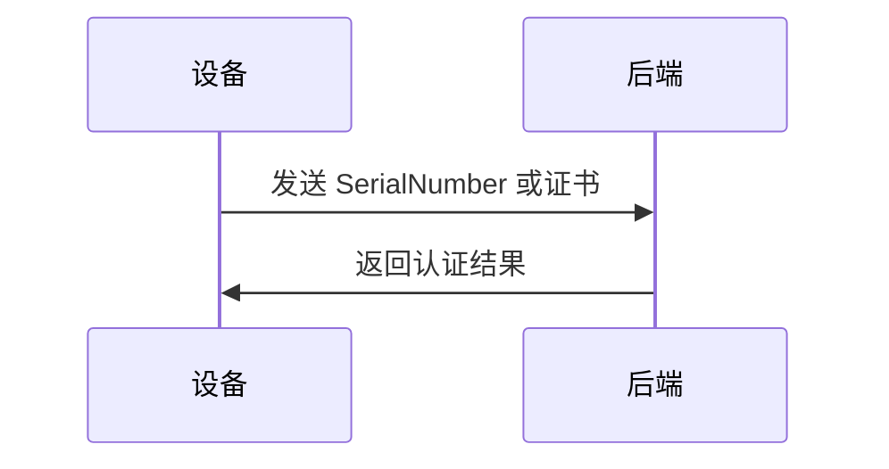
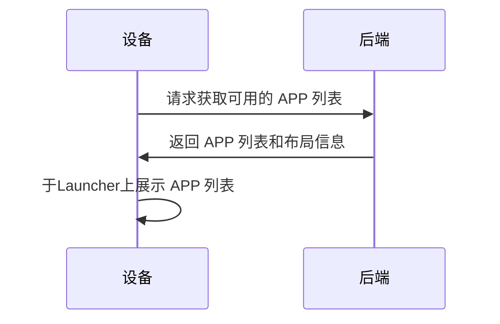
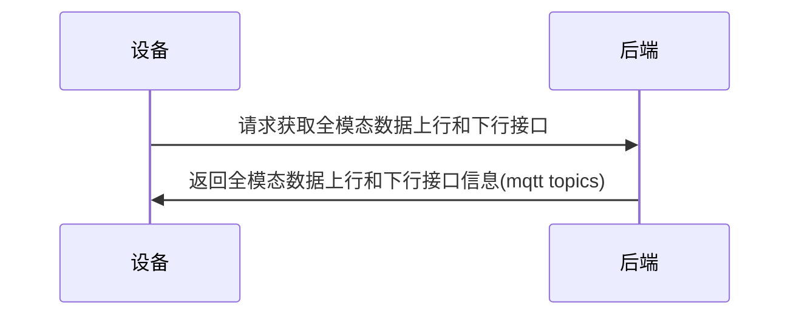
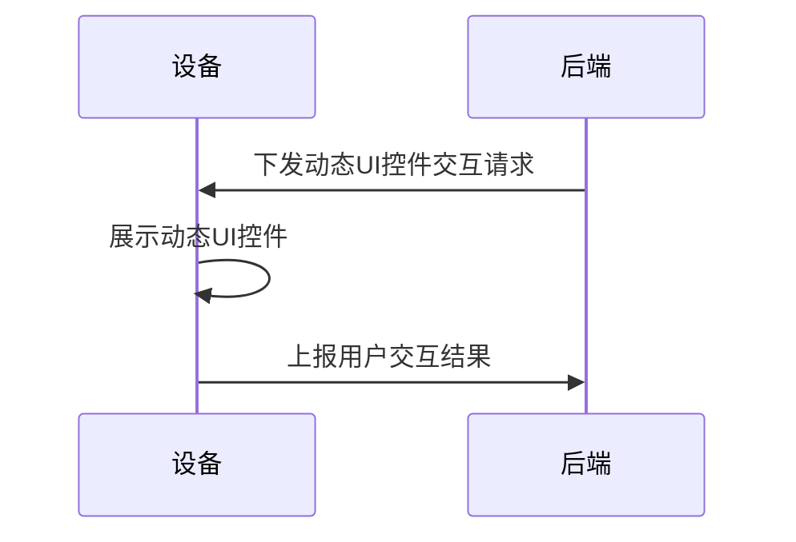
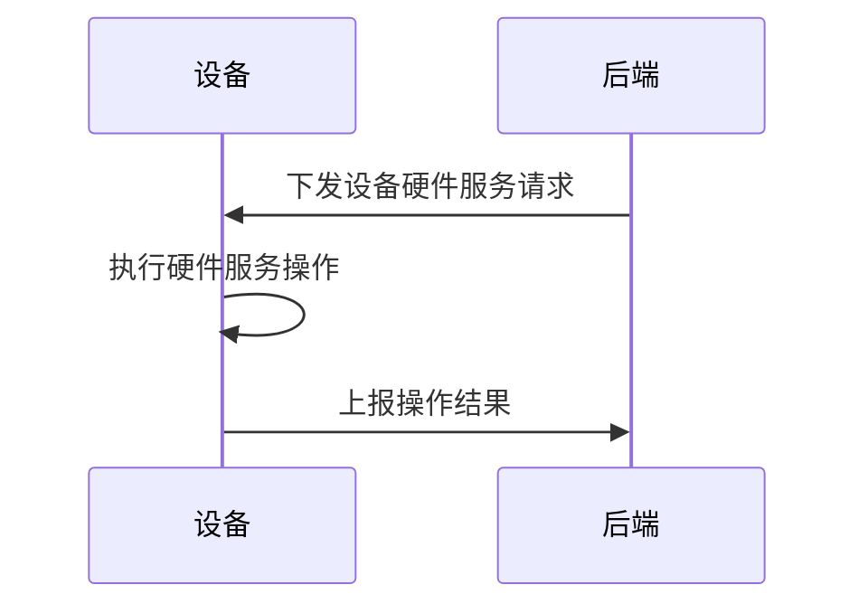

# Intro
非严肃场景下的 AI 应用的入口, 即此文中说到的设备侧的 APP, 应该是轻量和低业务的, 它服务于与用户的简单自然行为交互的目的, 如自然语言输入, 直接摄像头图像输入, 自然语言输出, 图像输出.    
> 请想像设备侧 APP 就是 AI 数字助手的脸部, 有眼睛, 有嘴巴, 有耳朵. 而大脑位于云端.

为进一步提升产品力, Agent 是必备能力, 但考虑到当前 LLM 以及 Agent 能力的局限, 对于关键性的 Agent 使用仍需要`human in the loop`式的传统交互, 以达到确认和`auditing`的目的.
> 请想像场景: 用户通过自然语音提出预定一杯咖啡的请求, 后端 Agent 处理请求, 显然此请求涉及线下服务, 属于关键性的功能, 所以往往需要在 APP 侧展示确认按钮, 供用户确认是否继续执行.

在以上前提下, 希望能抽象出一些规范和接口, 以便于未来各种场景下的 AI 应用的快速开发.

# Universal API 设计文档
本协议旨在提供统一的接口和流程来处理硬件端与后端之间的通信, 以覆盖以下几类功能:
* 设备认证
    只有经过认证的设备才能访问后端服务.
* 获取 APP 信息
    设备上可运行的 APP, 以及 APP 的展现形式需要从后端获取和动态展现.
    * APP 全模态数据上下行信息
    设备可以上传/下载各种类型的数据，包括文本, 图像, 音频等.
* 动态 UI 控件交互
    后端可以下发展示动态 UI 控件的请求, 设备侧 APP 可以根据这些控件进行交互, 并将交互结果上报给后端.
* 设备硬件服务
    后端可以主动调用设备的硬件服务, 如摄像头拍摄, 开启/关闭麦克风等功能.
## 设备认证
设备发送硬件 `SerialNumber` 或者证书到后端进行身份认证.

## 获取 APP 信息
### 基础信息
设备应有 Launcher 桌面应用, 该应用负责展示设备上可用的 APP 列表, 并提供启动 APP 的入口, 即类似手机桌面上的应用图标.

而 APP 由2部分组成:
* Layout
    设备侧APP的布局信息, 包括UI控件的类型, 位置, 大小等.
    > 此信息不由协议定义, 而是采用事先线下约定.

    本协议将直接使用约定好的 Layout 类型, 最常用的类型是`WeChat`, 即拥有类似微信聊天界面的布局, 应包括:
    * 顶部标题栏
    * 中部的大面积聊天历史框
    * 底部操作按钮
        实时通话; 拍照; 录音输入.
* 行为
    即指布局中的UI控件的交互行为.
    > 细节不由协议定义.    

    本协议仅简单定义通讯相关的, 即上行和下行2类, 上行包括全模态数据上行, 下行包括全模态数据下行和动态UI控件交互.
### 全模态数据上下行信息
在某具体 APP 运行时, 设备需要通过向后端请求获取全模态数据上行和下行的接口, 以便于进行数据交互, 默认均采用 mqtt 协议.

## 动态UI控件交互
设备侧APP可以接收后端主动下发的动态UI控件交互请求, 以便于进行用户交互.
> 仅定义最简单的交互, 即用户点击按钮, 选择下拉框等, 复杂的交互如多步流程等不在本协议范围内.

## 设备硬件服务
设备侧APP可以接收后端主动调用的设备硬件服务请求, 以便于进行硬件操作.
例如音量调节, 摄像头拍摄, 开启/关闭麦克风等功能.

