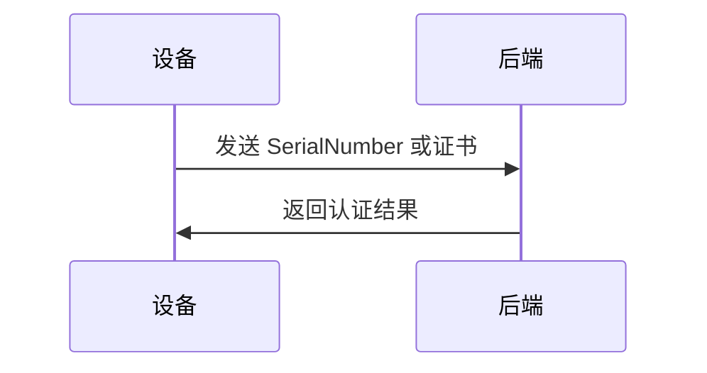
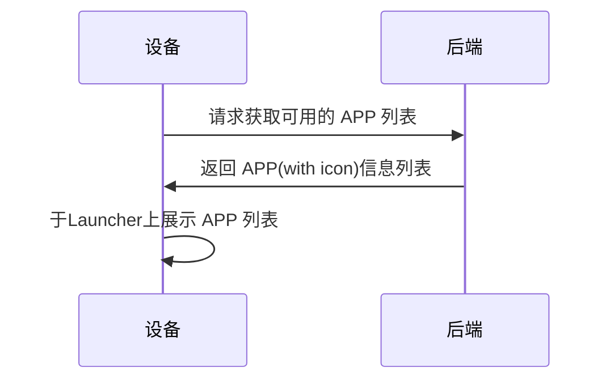
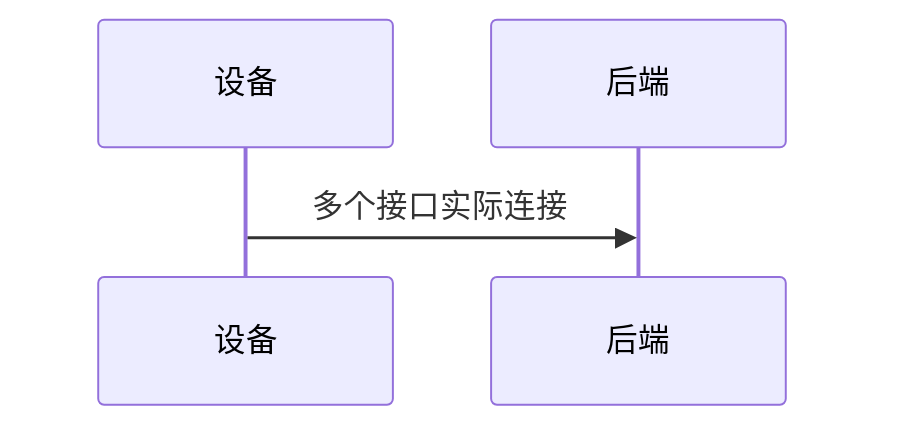
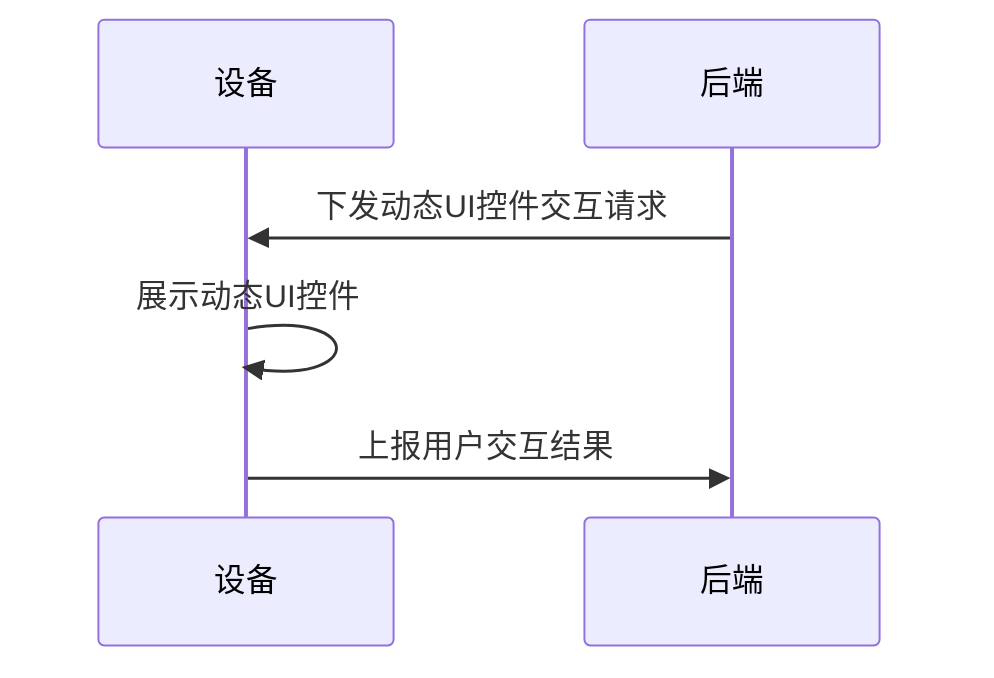
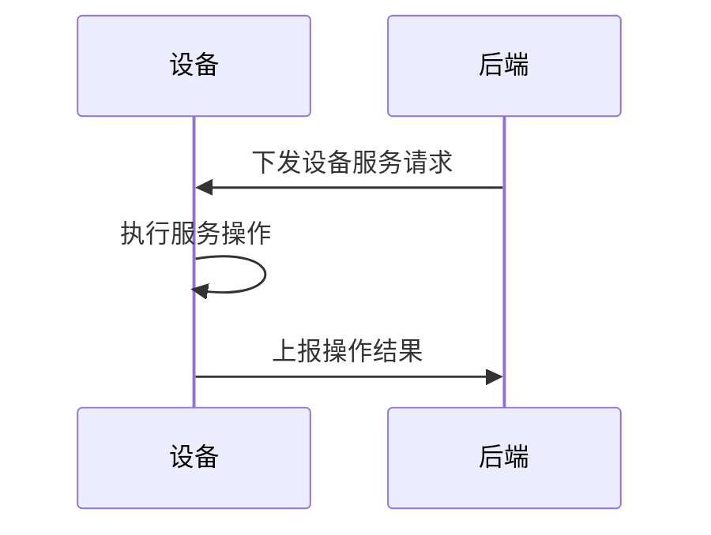

# Intro
LLM 本身能力进入平台期, 业界转向多模态方向, 应用应着力于释放此能力, 着重落地智能体, 和尝试新的 UI 设计.     
非严肃场景下的 AI 应用的入口, 即此文中说到的设备侧的 APP, 应该是轻量和低业务的, 它服务于与用户的简单自然行为交互的目的, 如自然语言输入/输出, 图像输入/输出.    
> 请想像此文中的 APP 就是一个拟人的 AI 数字助手, 它拥有眼睛(摄像头), 嘴(SPK), 耳朵(MIC). 而大脑位于云端.

为进一步提升产品力, Agent 是必备能力, 但考虑到当前 LLM 以及 Agent 能力的局限, 对于关键性的 Agent 使用仍需要`human in the loop`式的传统交互, 以达到用户确认和`auditing` (认证)的目的.
> 请想像场景: 用户通过自然语音提出预定一杯咖啡的请求, 后端 Agent 处理请求, 显然此请求涉及线下服务, 涉及支付等关键性功能, 所以往往需要在 APP 侧展示确认按钮, 供用户确认是否继续执行.

在以上前提下, 希望能抽象出一些规范和接口, 以便于未来各种场景下的 AI 应用的快速开发.

# Universal APP API 设计文档
本协议旨在提供统一的接口和流程来处理硬件端与后端之间的通信, 以覆盖以下流程:
* 设备认证    
    只有经过认证的设备才能访问后端服务.
* 获取 APP 信息    
    设备上可运行的 APP, 以及 APP 的展现形式需要从后端获取和动态展现, 所有设备隐含有可视化桌面`Launcher`的概念, 在桌面上展示的 APP 是动态的.
    * APP LAYOUT 信息    
      桌面上显示的 APP 的列表
    * APP 数据上下行通道信息    
    APP 的核心能力就是提供 上传/下载 多模态的数据的通道，包括文本, 图像, 音频等.    
    以上数据需要通过这些获取到的通道, 即数据接口, 发送/下载 至后端.    
* 动态 UI 控件交互    
    后端可以下发展示动态 UI 控件的请求, 设备侧 APP 可以根据这些控件进行交互, 并将交互结果上报给后端.
* 设备服务    
    后端可以主动调用设备的服务, 如启动摄像头进行拍摄, 开启/关闭麦克风等功能.
## 设备认证
设备发送硬件 `SerialNumber` 或者证书到后端进行身份认证.

## 获取 APP 信息
### 获取基础信息
设备应有 Launcher 桌面应用, 该应用负责展示设备上可用的 APP 列表, 并提供启动 APP 的入口, 即类似手机桌面上的应用图标.

而 APP 由2部分组成:
* Layout    
    设备侧 APP 的布局信息, 包括 UI 控件的类型, 位置, 大小等.    
    布局是为了行使数字人前端功能, 即与用户进行自然交互的界面.    
    > 此信息不由协议定义, 采用事先线下约定.

    本协议将直接使用约定好的 Layout 类型, 最常用的类型是`chatter_basic`, 即拥有类似微信聊天界面的布局, 应包括:    
    * 顶部标题栏    
      简介当前数字人的功能
    * 中部的大面积聊天历史框    
    * 中下部的快捷功能按钮    
    * 底部操作按钮    
        实时通话; 拍照; 录音输入.

    示例图:    
      

* 行为    
    即指布局中的 UI 控件的后端交互行为.
    行为是为了行使数字人收集和传送信息, 与用户进行通信交流的目的.
    行为的技术表现是控件与 上传/下载 多模态的数据的通道绑定的过程, 如某个按钮点击后收集什么类型的信息, 并通过什么通道上传.

    
### 获取数据上下行接口信息
在运行某具体 APP 前, 设备需要使用已经向后端请求获取 APP 的行为中的接口, 即全模态数据上行和下行的接口, 并实际进行连接, 以便数据交互.

## 动态UI控件交互
设备侧APP可以接收后端主动下发的动态 UI 控件交互请求, 以便于进行用户交互.
> 仅定义最简单的交互, 比如: 点击确定按钮; 选择下拉框等, 复杂的交互如多步流程应尽量避免.

## 设备服务
设备侧APP可以接收后端主动调用的设备服务请求, 以执行对应操作.
例如音量调节, 摄像头拍摄, 开启/关闭麦克风等功能.

