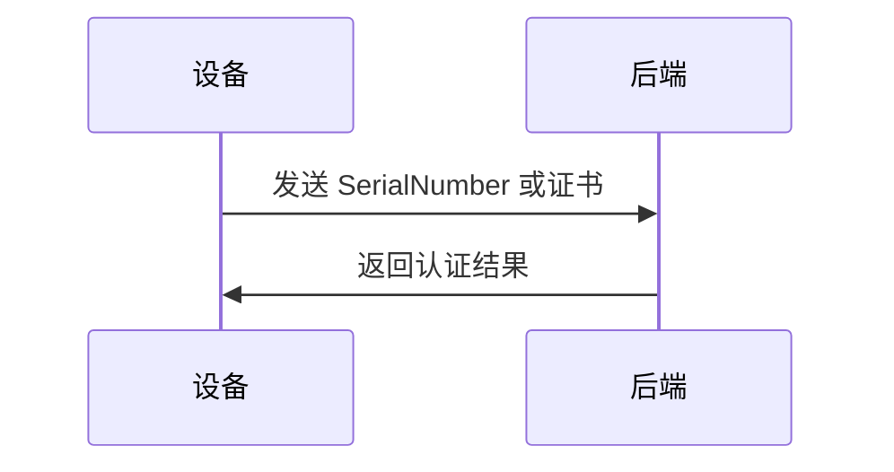
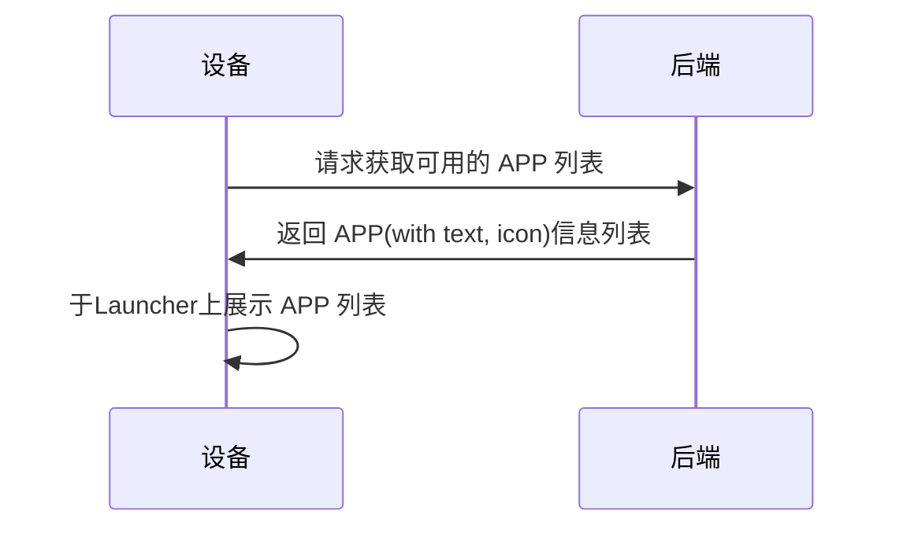
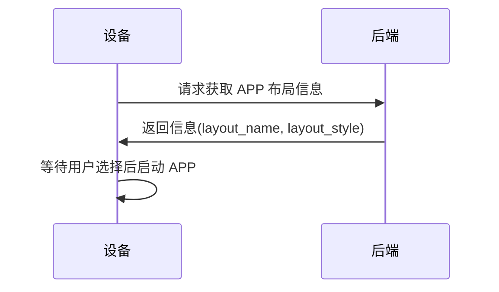
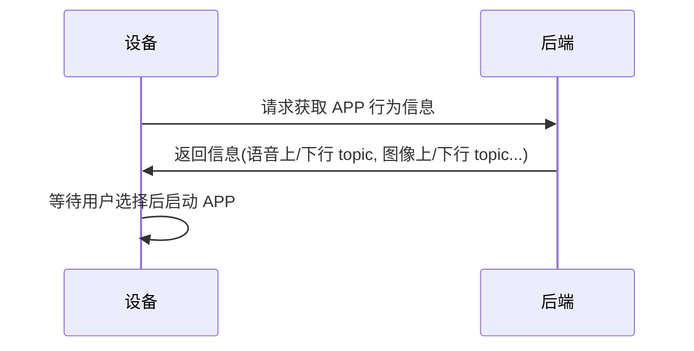
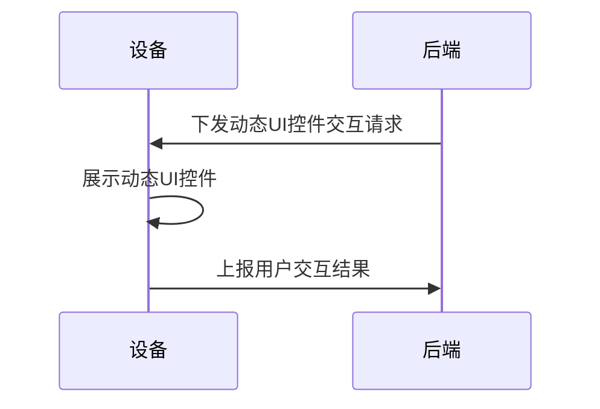
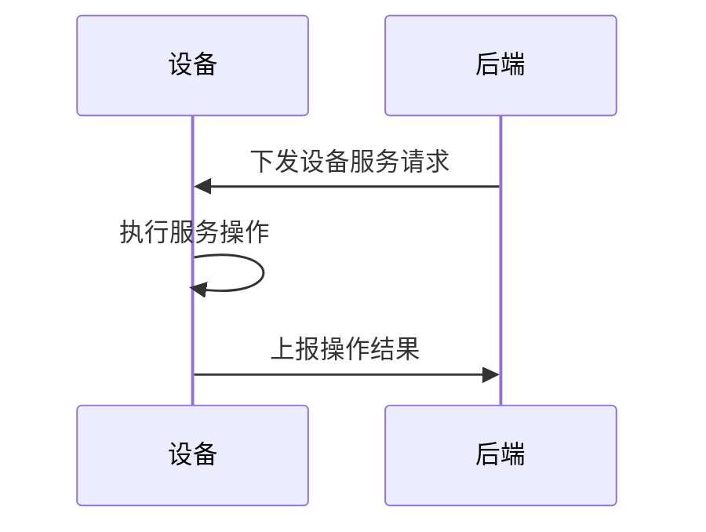

# Intro
## 观察
* LLM 能解构自然语言 - 传统 UI 设计的复杂性应能够被简化.        
* AI 模型多模态能力的增强 - 应用要配合释放此能力.    
* AI 应用在不同用户场景下有区别 - 需要团队快速适配.    
* Agent 应用发展迅速 - 需要团队积累开发经验.     

## 目标
基于硬件产品的轻娱乐化的属性, 希望通过此项目, 来实现:    
* 定义通用 APP 理念/技术框架    
    所有场景下的 APP 应该是轻量和低业务的, 它服务于与用户简单自然行为交互的目的, 如自然语言输入/输出, 图像输入/输出.    
    > 想像 APP 是一个 AI 数字人助手的整个面部, 它拥有眼睛(摄像头), 嘴(SPK), 耳朵(MIC), 脸(SCREEN).    
    > 而大脑位于云端.    

    APP 也应该有一定的场景特定适配能力, 以便于快速适配不同的用户场景, 如导览机, 相框等, 这一方是增强用户体验, 一方面是收费模式的便利 (APP 动态出现在不同设备上).

* 实现全面的多模态内容处理能力    
    要对文生图, 声音生图, 以及视频生成等内容进行支持.

* 落地 Agent 能力    
    Agent 能力是指基于 AI 模型能力进行的任务的自动化处理, 如预定餐厅, 订购商品等.    
    考虑到当前 LLM 以及 Agent 能力的局限, 对于关键性的 Agent 使用仍需要`human in the loop`式的传统交互, 以达到用户确认和 `auditing` (认证)的目的, 这也要求 APP 能够与用户进行简单的交互, 如点击确认按钮等.    
    > 请想像场景: 用户通过自然语音提出预定一杯咖啡的请求, 后端 Agent 处理请求, 显然此请求涉及线下服务, 涉及支付等关键性功能, 所以往往需要在 APP 侧展示确认按钮, 供用户确认是否继续执行.

在以上前提下, 本文试图提供规范和接口, 以实现目标.

# Universal APP API 概述
本协议定义接口和流程来, 来处理硬件端与后端之间的通信, 主要流程包括:
* 设备认证    
    只有经过认证的设备才能访问后端服务.
* 获取桌面 APP 列表信息    
    设备隐含有桌面 launcher 的概念.    
    设备系统启动后, 应获取后端提供的可用 APP 列表, 包括app简称和icon, 以展现给用户.
    APP 列表将绑定于不同客户, 以及不同设备类型.
* 获取 APP 信息    
    具体 APP 运行前, 设备侧需要获取 APP 的布局信息和行为信息.   
* 动态 UI 控件交互    
    具体 APP 运行后, 后端可下发展示动态 UI 控件的请求, APP 应响应请求展示 交互 UI 控件, 并将交互结果上报给后端.
* 设备远程服务    
    MCP 概念.    
    后端可以主动调用设备的服务, 如启动摄像头进行拍摄, 开启/关闭麦克风等功能.
## 设备认证
设备发送硬件 `SerialNumber` 或者证书到后端进行身份认证.

## 获取桌面 APP 列表信息

## 获取 APP 具体信息
APP 具体信息由2部分组成:
### Layout 信息
设备侧 APP 的布局信息, 定义了外观和控件类型.    
协议中并不包含具体的技术细节, 而是采用预定义的`layout_name`字段来标识布局类型.

以最常用的类型为示例, 其预定义的名称是`chatter_basic`, 即拥有类似微信聊天界面的布局, 应完整包括:
* 顶部通知栏    
    点击后的行为可简单定义, 如开始音视频播放, 二维码展示, 文字通知等.    
    主要用于长时间的后台服务提醒.    
* 顶部标题栏    
    简介当前数字人的功能
* 中部的大面积聊天历史框    
* 中下部的动态快捷功能按钮    
* 底部操作按钮    
    实时通话; 拍照; 录音输入.

> 未来对于不同场景, 可以定义新的双方约定的`layout_name`.    
> 注意, 如果控件类型完全一致, 无论其位置和样式如何差别, 都应属于同一个 APP LAYOUT.
> 如果只是控件位置的差别, 则建议子参数, 如 `Style` 等来控制.

`chatter_basic`示例图:    
    

### 行为信息    
即指布局中的 UI 控件的后端交互行为.    
对于静态控件, 技术上体现为控件绑定的多模态内容的上/下行接口.    
快捷功能, 采用预先约定的方式进行, 产品化后应该是独立成为一个 APP???

    
## 动态 UI 控件交互
设备侧 APP 接收后端主动下发的动态 UI 控件交互请求, 与用户交互.    
至少实现以下几种:     
* 确定/取消 弹窗 - 超时自动关闭;背景图片(二维码?);上报用户交互结果.
* 选择列表 弹窗 - 超时自动关闭;背景图片;上报用户交互结果.

## 设备远程服务
设备侧APP可以接收后端主动调用的设备服务请求, 以执行对应操作.
例如音量调节, 摄像头拍摄, 开启/关闭麦克风等功能.

