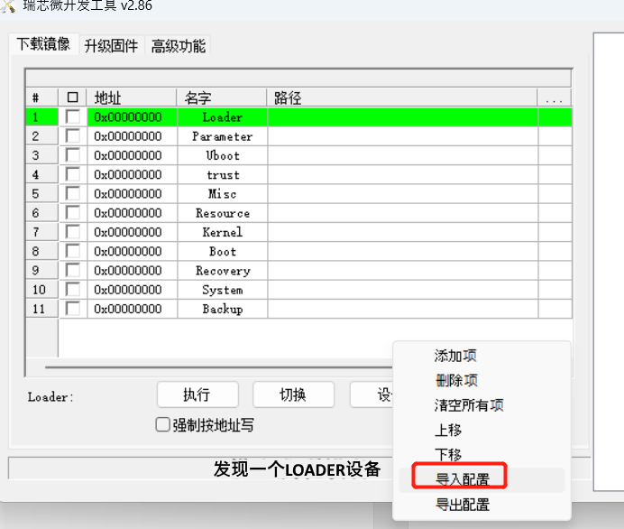
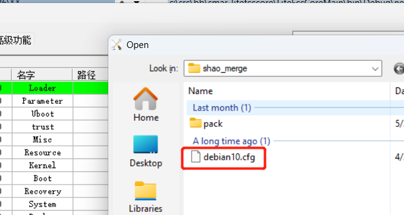
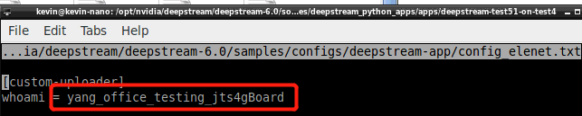
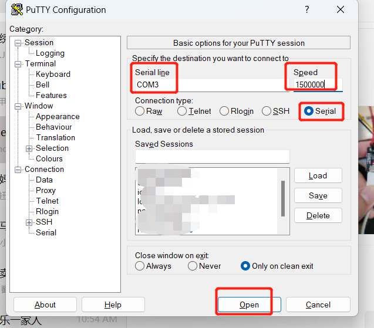

# Flash in Debian 10 to board

Install board Driver at your Windows PC from: 
> `DriverAssitant_v4.5\DriverInstall.exe`

打开 RKDevTool at your Windows PC from：
> c:\xxxxx\RKDevTool\RKDevTool_Release_v2.86\RKDevTool.exe

拔掉板子上的 Usb Otg线、网线、电源线，然后确保板子上所有灯（网口旁边的两个绿色LED灯）都熄灭了。
再接入(请先不要接入电源线)Usb Otg线到板子的 **图示 USB TYPE A 接口** ，另一头到 PC:


手按住板子上的 Recover 按钮, 保持住, 再接上电源线，等2秒钟，松 Recover 按钮，`RKDevTool`的主界面上将显示发现了adb device，如图：


> 应该注意的是，进入 RecoveryMode 的板子是不会在 WindowsDeviceManager 里有任何item的。
> 所以在现在还未刷机完成,板子还未进入debian 10系统前， WindowsDeviceManager不会有任何设备出现，而只有板子在正常完全进入系统后，才有rk3xxx出现在usb设备中

导入配置：


Select the debian 10 config file:



Select each `.img` one by one:


点击“执行”, 开始刷入：


10分钟左右，应看到 RKDev_tool 右侧进度都完成，板子将自动重启并进入Debian 10系统了。

验证是否系统正常启动请参考 Section: How to putty to board by serial port
## how to adb
For Ubuntu PC, unplug otg usb, unplug power cable, all board LED off, then plug power cable, wait 5s, plug in otg usb, should see a mobile icon in PC, and then `adb devices` should see the board.

## windows
never worked.
# Setup Debian 10

## Install Frp client
Download frp release (server and client are together) from https://github.com/fatedier/frp/releases and untar it into folder: `/home/firefly/Download/frp_0.43.0_linux_arm/`.

As a frp client, edit the `/home/firefly/Download/frp_0.43.0_linux_arm/frpc.ini`，input below content (the below sample config defaultly use `6000` port, you should gurantee it's **UNIQUE per board**, so for most case, you need change the `remote_port` for your situation):
```
[common]
server_addr = msg.glfiot.com
server_port = 7000

[ssh]
type = tcp
local_ip = 127.0.0.1
local_port = 22
remote_port = 6000
```
Create a system service for auto start the `frp client` when system started:

```
sudo nano /etc/systemd/system/frpc.service
```

input below content:

```
[Unit]
Description=Frp client
Wants=network.target
After=network.target
[Service]
#before start the service, always sleep 5 second, for wait the system ready?
ExecStartPre=/bin/sleep 5
WorkingDirectory=/home/firefly/Download/frp_0.43.0_linux_arm/
ExecStart=/home/firefly/Download/frp_0.43.0_linux_arm/frpc -c 'frpc.ini'
Restart=always
#Restart service after 10 seconds if this service crashes:
RestartSec=10
[Install]
WantedBy=multi-user.target
```

ctrl+o, y, ctrl+x, exit from nano, and activate the service.
```
sudo systemctl enable frpc.service
# sudo systemctl start frpc.service
# sudo systemctl status frpc.service
# sudo systemctl daemon-reload
```

then you can use it like:


then you could check the connection state via the frp server (installed at msg.glfiot.com) web page at: http://msg.glfiot.com:7500/static/#/proxies/tcp
## Install packages
Below use **serial port** to Putty into board, but the tcp putty should be similar.
Make sure the system is internet connected

### Install apt packages
```
sudo apt update
sudo apt-get install multiarch-support
sudo apt --fix-broken install
sudo apt install git
cd /home/firefly/

# Clone from official branch, clone the original repo is not used anymore since the huge size, then I picked # up the necessary files into https://github.com/shaojun/rv1126_elenet.git for convinient
# git clone https://gitlab.com/firefly-linux/external/rknn-toolkit.git -b rv1126_rv1109/firefly
#firefly@firefly:~/rknn-toolkit/rknn-toolkit-lite/rknn-toolkit-lite-v1.7.0.dev_0cfb22/requires$ sudo #dpkg -i libjasper1_1.900.1-debian1-2.4+deb8u6_armhf.deb
#firefly@firefly:~/rknn-toolkit/rknn-toolkit-lite/rknn-toolkit-lite-v1.7.0.dev_0cfb22/requires$ sudo #dpkg -i libjasper-dev_1.900.1-debian1-2.4+deb8u6_armhf.deb


git clone https://github.com/shaojun/rv1126_elenet.git
sudo dpkg -i installation/requires/libjasper1_1.900.1-debian1-2.4+deb8u6_armhf.deb
sudo dpkg -i installation/requires/libjasper-dev_1.900.1-debian1-2.4+deb8u6_armhf.deb

sudo apt-get install libhdf5-dev
sudo apt-get install libatlas-base-dev
sudo apt-get install libqtgui4
sudo apt-get install libqt4-test

```
### Install Python packages
#### Install by simple-copy
the simple-copy could save some time compare to install by `pip`.
the `dist-packages` already prepared under repo `rv1126_elenet`, the content is like:


```
chown -hR firefly:firefly /usr/local/lib/python3.7/dist-packages/
```
Copy the prepared `dist-packages` to board path:
```
cp -r /home/firefly/rv1126_elenet/installation/dist-packages/* /usr/local/lib/python3.7/dist-packages/
```
finally, the board folder structure is like:


you could then see if it works if no errors show after `import cv2`:
```
python3
import cv2
```
#### Install by pip - !!!don't do it if already did simple-copy
```
pip3 install numpy==1.16.3
pip3 install psutil==5.6.2
pip3 install ruamel.yaml==0.15.81
pip3 install bson
pip3 install kafka-python
pip3 install pymongo

#firefly@firefly:~/rknn-toolkit/rknn-toolkit-lite/rknn-toolkit-lite-v1.7.0.dev_0cfb22/requires$ pip3 #install opencv_python-4.0.1.24-cp37-cp37m-linux_armv7l.whl
pip3 install /home/firefly/rv1126_elenet/installation/requires/opencv_python-4.0.1.24-cp37-cp37m-linux_armv7l.whl

#firefly@firefly:~/rknn-toolkit/rknn-toolkit-lite/rknn-toolkit-lite-v1.7.0.dev_0cfb22/packages$ pip3 #install rknn_toolkit_lite-1.7.0.dev_0cfb22-cp37-cp37m-linux_armv7l.whl
pip3 install /home/firefly/rv1126_elenet/installation/packages/rknn_toolkit_lite-1.7.0.dev_0cfb22-cp37-cp37m-linux_armv7l.whl
```
## Prepare elenet

### Config  _whoami_ Id
`whoami` is for identify each board device when multiple boards send messages to a remote kafka server,  **SHOULD**  keep this id unique  **per board**.

This `id` will be carried into a message and send to a remote  _kafka_  server as the objects detected constantly from local video stream, then the server message subscribers would know the source of the messages.

> this id also should be known by cloud side, so there must have a webpage provided by cloud side, like device registering portal, to allow you input the id there as well.

### Editing and input `whoamid` id:
```
cd /home/firefly/
ls config_elenet.txt  # you should see the file exists!
nano config_elenet.txt  # start edit it.
#input your unique id under the section custom-uploader -> whoami
``` 
can refer picture below, the red part is the `whoami` id:



### Save and copy config_elenet.txt to:
make sure below path exists:
>  /opt/nvidia/deepstream/deepstream-6.0/samples/configs/deepstream-app/

or create it by: 
```
mkdir -p  /opt/nvidia/deepstream/deepstream-6.0/samples/configs/deepstream-app/
```


save above content in `nano` by `ctr`+`o`, and then copy config file to target path:

```
sudo cp config_elenet.txt  /opt/nvidia/deepstream/deepstream-6.0/samples/configs/deepstream-app/
```

### Run:

```
cd /home/firefly/rv1126_elenet
sudo python3 test_yolov5s_rtsp.py

# or for use specified rstp stream
# sudo python3 test_yolov5s_rtsp.py -i rtsp://YourSpecifiedUrl

# or for print debug info to console and output infer result to a local output folder:
# sudo python3 test_yolov5s_rtsp.py --enable-verbose true --enable-output true
```

# How to putty to board by serial port
wiring like below picture:


you should see a com port is created on you Windows PC:


open putty, Serial line input `COM3` for my situation,Speed to `1500000`,



`Open` then you should get the terminal console, after several `Enter`, input `/sbin/ifconfig` to check ip address (make sure you have LAN cable connected and with `dhcp` enabled):
```
root@firefly:/home/firefly# /sbin/ifconfig
enx00e04cc4edfa: flags=4099<UP,BROADCAST,MULTICAST>  mtu 1500
        ether 00:e0:4c:c4:ed:fa  txqueuelen 1000  (Ethernet)
        RX packets 0  bytes 0 (0.0 B)
        RX errors 0  dropped 0  overruns 0  frame 0
        TX packets 0  bytes 0 (0.0 B)
        TX errors 0  dropped 0 overruns 0  carrier 0  collisions 0

eth0: flags=4163<UP,BROADCAST,RUNNING,MULTICAST>  mtu 1500
        inet 192.168.0.130  netmask 255.255.255.0  broadcast 192.168.0.255
        ether ba:c9:11:2f:02:2c  txqueuelen 1000  (Ethernet)
        RX packets 10752016  bytes 685211272 (653.4 MiB)
        RX errors 0  dropped 0  overruns 0  frame 0
        TX packets 1417689  bytes 374737499 (357.3 MiB)
        TX errors 0  dropped 0 overruns 0  carrier 0  collisions 0
        device interrupt 63
```
the `eth0` is the LAN interface, the ip address for my situation is `192.168.0.130`, you can then also use the ip to putty in.

# Useful links
## how to install rknntookitlite
this is tested and works, basically the above steps is highly concluded from this post

https://dev.t-firefly.com/thread-104204-1-1.html
## how to pack rootfs
### raw post:
https://dev.t-firefly.com/thread-118433-1-3.html

https://wiki.t-firefly.com/zh_CN/Firefly-RK3399/export_dev_sf.html

https://wiki.t-firefly.com/zh_CN/CORE-1126-JD4/Debian10.html#
https://wiki.t-firefly.com/zh_CN/CORE-1126-JD4/Debian10.html#fen-qu-jie-shao
### steps
* Prepare a 32G (or above size) Usb Drive
* At your windows PC, download the _DiskGenius_ tool
https://engdownload.eassos.cn/DGEngSetup5431342.exe
* Format the usb drive with `ext4` by tool

* Copy the export tool to board Debian system
The export tool is at `resource/ff_export_rootfs_buildroot.tar`.
Copy it to `firefly@firefly:~/Download/`.
De-compress it by: `tar -xzvf ff_export_rootfs_buildroot.tar`
* Plug in the Usb Drive to board usb port
* Check Usb Drive name in board Debian
    ```
    firefly@firefly:~/Download/ff_export_rootfs_buildroot$ lsblk
    NAME         MAJ:MIN RM  SIZE RO TYPE MOUNTPOINT
    sda            8:0    1 58.7G  0 disk
    `-sda1         8:1    1 58.7G  0 part
    mmcblk0      179:0    0 14.6G  0 disk
    |-mmcblk0p1  179:1    0    4M  0 part
    |-mmcblk0p2  179:2    0    4M  0 part
    |-mmcblk0p3  179:3    0   32M  0 part
    |-mmcblk0p4  179:4    0   32M  0 part
    |-mmcblk0p5  179:5    0   32M  0 part
    |-mmcblk0p6  179:6    0    2G  0 part /root-ro
    |-mmcblk0p7  179:7    0  192M  0 part
    `-mmcblk0p8  179:8    0 12.3G  0 part /userdata
    mmcblk0boot0 179:32   0    4M  1 disk
    mmcblk0boot1 179:64   0    4M  1 disk
    ```
    that `sda1` with size 58.7G is your USB Drive.
* Create a folder in board Debian for mount Usb Drive
`mkdir /media/usb_drive`
* Mount Usb Drive in board Debian
`sudo mount /dev/sda1 /media/usb_drive`
* Export
    in board Debian, will take minutes to go:
    ```
    firefly@firefly:~/Download/ff_export_rootfs_buildroot$ sudo ./ff_export_rootfs /media/usb_drive/
    MEDIA FREE SPACE SIZE    55975   MBytes
    EXPORT IMAGE SIZE        8568    MBytes
    find: '/proc/896/task/896/net': Invalid argument
    find: '/proc/896/net': Invalid argument
    find: '/proc/936/task/936/net': Invalid argument
    find: '/proc/936/net': Invalid argument
    find: '/proc/1139/task/1139/net': Invalid argument
    find: '/proc/1139/net': Invalid argument
    BLOCK_COUNT 9290489
    INODE_COUNT 169877
    sync...
    sync finish
    Export rootfs to /media/usb_drive//Firefly_ext4_202206170232.img Success
    ```
    see the export file sample:
    
* Resize
    in board Debian
    ```
    cd /media/usb_drive
    firefly@firefly:/media/usb_drive$ sudo /sbin/e2fsck -p -f Firefly_ext4_202206170232.img
    [sudo] password for firefly:
    rootfs: 48731/172520 files (14.6% non-contiguous), 7706484/9290489 blocks
    firefly@firefly:/media/usb_drive$ sudo /sbin/resize2fs -M Firefly_ext4_202206170232.img
    resize2fs 1.44.5 (15-Dec-2018)
    Resizing the filesystem on Firefly_ext4_202206170232.img to 7702411 (1k) blocks.
    The filesystem on Firefly_ext4_202206170232.img is now 7702411 (1k) blocks long.
    ```

* Repack - **!!!SKIP this for RV1126**
**YOU SHOULD NOT DO THIS FOR RV1126**
COPY `resource/firefly-rk3399-linux-repack.tgz` to your **Ubuntu PC**.
COPY the new packed and resized `.img` file (like above resized one: _Firefly_ext4_202206170232.img_) to same folder, and rename it to `udpate.img`, then the folder structure is like:
    ```
    (base) shawn@DESKTOP-9NG0VFK:~/Downloads/firefly-rk3399-linux-repack$ ls
    bin  output  pack.sh  Readme.md  unpack.sh  update.img
    ```
    start unpack:
    ```
    sudo ./unpack.sh
    start to unpack update.img...
    ********RKImageMaker ver 1.66********
    Unpacking image, please wait...
    Error:Check update.img failed!
    Press any key to quit:
    ```

* Prepare the `parameter.txt` file
here take an export file: `Firefly_ext4_202206240234.img` as example (not the one in above sample, but the theory should be the same).
Copy the exported file `Firefly_ext4_202206240234.img` from board to Your Windows PC:

Can see its size is 5.84GB.
`parameter.txt` is used in firmware flashing for locating each partition (you can see several `*.img` files are used in flashing), here is the sample of the `parameter.txt` from firefly official Debian 10 firmware packages:

    >FIRMWARE_VER: 8.1
MACHINE_MODEL: RV1126
MACHINE_ID: 007
MANUFACTURER: RV1126
MAGIC: 0x5041524B
ATAG: 0x00200800
MACHINE: 0xffffffff
CHECK_MASK: 0x80
PWR_HLD: 0,0,A,0,1
TYPE: GPT
CMDLINE: mtdparts=rk29xxnand:0x00002000@0x00004000(uboot),0x00002000@0x00006000(misc),0x00010000@0x00008000(boot),0x00010000@0x00018000(recovery),0x00010000@0x00028000(backup),0x00C00000@0x00038000(rootfs),0x00060000@0x00C38000(oem),-@0x00C98000(userdata:grow)
uuid:rootfs=614e0000-0000-4b53-8000-1d28000054a9

    As you're packing your own fireware, then only 2 Partition info need to be updated correspondingly with your new exported file(size), they are in the: 
    >0x00C00000@0x00038000(rootfs),0x00060000@0x00C38000(oem),-@0x00C98000(userdata:grow)

    * Partition `rootfs`
    the exported file is actually a new `rootfs` that is supposed to replacing the old (official) one, once replaced, the partition size need to adjust as well.
    `0x00C00000` is `rootfs` partition size, it must greater than the file `rootfs.img` size, the requried `rootfs` partition size's caculation can be understood with: `0x00C00000  块 * 512 字节每块 / 1024 / 1024 = 6144 MByte`, obvious the `6144` is greater(**and must**) than actual `rootfs.img` file size(5.84GB), it's a proper value here, it also means you can set higher value(but don't know the impact?).

    * Partition `oem`:
        >0x00060000@0x00C38000(oem)

        because this partition is following `rootfs` partition, so with the adjustment of `rootfs` partition, we need to update the `oem` partition as well with rule: `分区大小 + 所在地址 = 下一个分区的所在地址` which is `0x00C00000 + 0x00038000 = 0x00C38000`

* Flashing `*.img` files to board
for your own fireware pack, replace that 2 files with yours, others still use the firefly official ones.
boot your board to flashing mode with previous steps.

import:


select file:


input each files:


 Detail steps please refer section: *Flash in Debian 10 to board*

