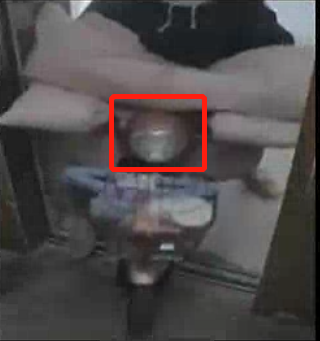
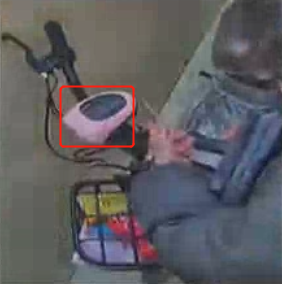
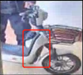
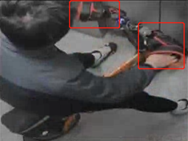
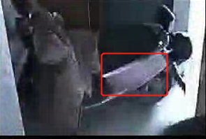
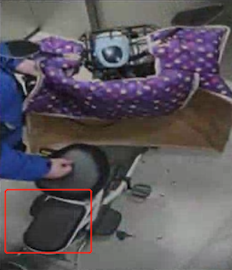
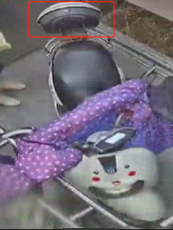

# 怎么样的算是自行车:    
  * 较多的侧面视野, 明显大尺寸的轮子(26寸及以上的自行车轮, 直径接近人大腿高度)

    
  * 车把特征
    * 山地车

    * 公路车   
  * 明显的车架区域
     简单的金属管细条,三角开关区域,且有脚踏
  * 有后辅助轮
  * 婴儿车
     有轮子出现 
  * 购物车
     有轮子出现
  * 滑板车
     有车把, 有轮子

# 怎么样的算是电车:
  * 有车头特征
    1. 有灯

        
  
        
    2. 仪表盘区

        
    3. 有大前挡区

        

        
    4. 反光镜

  * 有横向展开的雨披或者固定于车上的手套

    
  
  * 明显的横向视野的小尺寸轮子

  * 宽中梁脚休息区

    

    
  * 主座位下的电池腔体

    
  * 宽大后座(可至少乘坐第二人)

    
  
  * 后储物箱（位于座位上,球形或者扁球形）

    

    
  * 后宽软橡胶片泥档

    