# 怎么样的算是自行车
  ### 明显大尺寸的轮子

(画面中有明显的侧面视野, 否则也无法判断轮子大小了.)
轮子是**26寸及以上**的自行车轮, 即直径接近人大腿高度

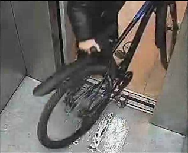
  ### 车把特征

此项特征仅包含下列的两项:
* 山地车
  立把

  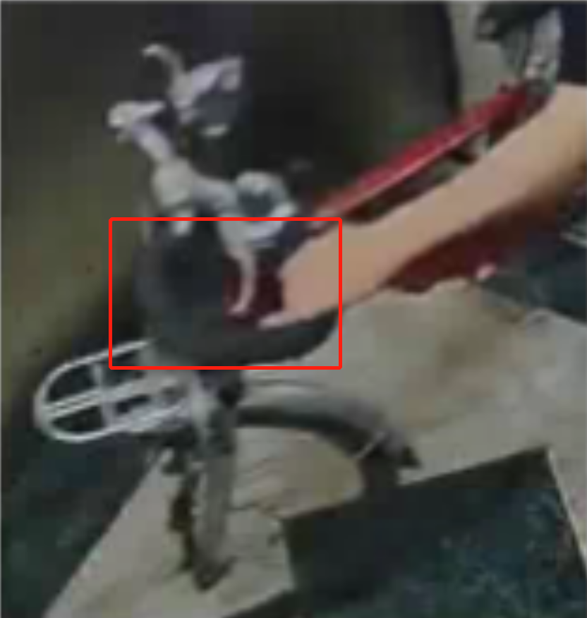
 * 公路车  
  弯把 
  ### 明显的车架区域
  
  清晰明了的金属管细条, 且明显三角区域,且有脚踏
  ### 有后辅助轮
  ### 婴儿车
  有轮子出现 
  ### 购物车
  有轮子出现
  ### 滑板车
  有车把, 有轮子

# 怎么样的算是电车:
  ### 车头特征
  1. 有灯

        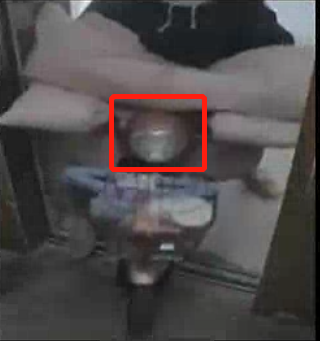  
        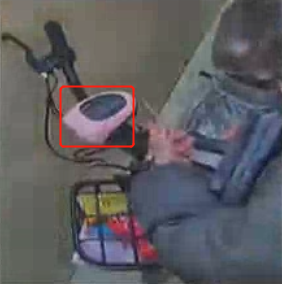
  2. 仪表盘区

        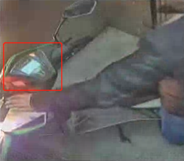
  3. 有大前挡区

        
        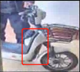
  4. 反光镜
        

  ### 有横向展开的雨披或者固定于车上的护手套

  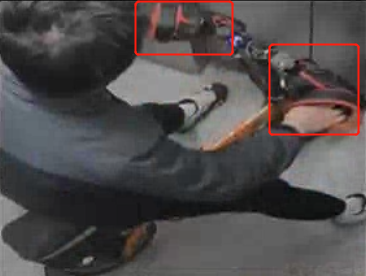
  
  ### 明显的横向视野的小尺寸轮子

  (画面中有明显的侧面视野, 否则也无法判断轮子大小了.)
  轮子直径**小于膝盖**高度

  ### 宽中梁脚休息区

  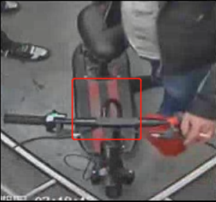
  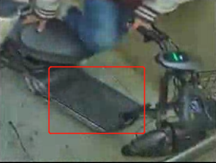
  ### 主座位下的电池腔体

  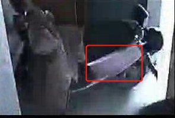
  ### 宽大后座

  特指用于乘坐第二人的座位

  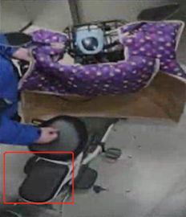
      
  ### 后储物箱
  
  位于后座位区,球形或者扁球形

  
  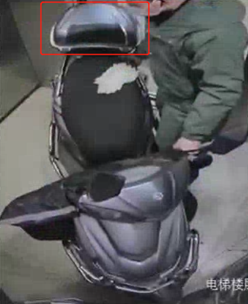
  ### 后宽软橡胶片泥档

  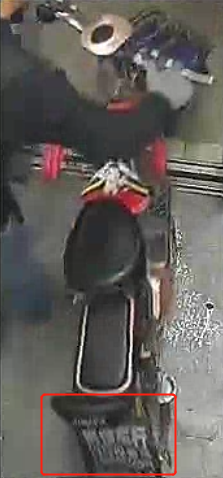
  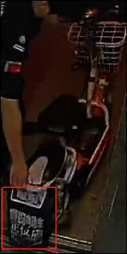