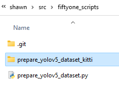
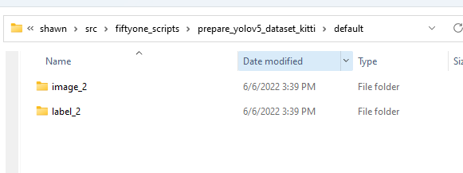
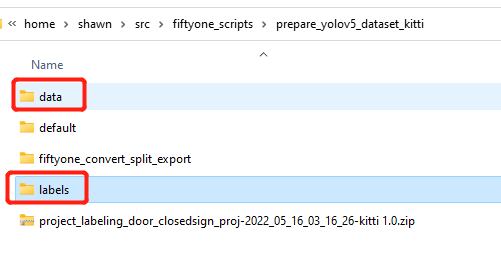
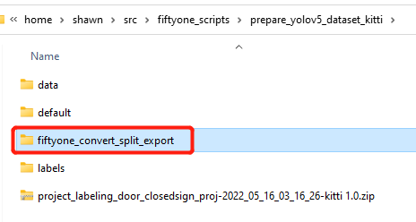
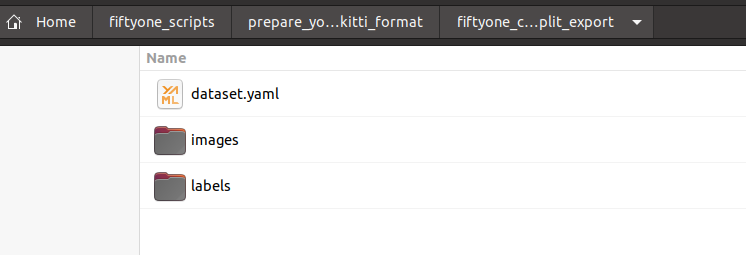
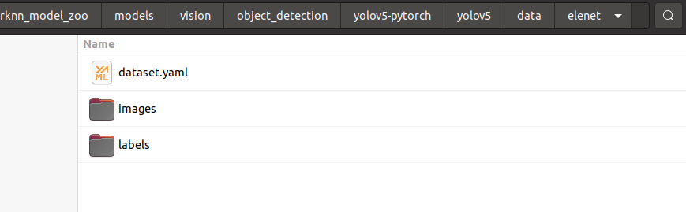
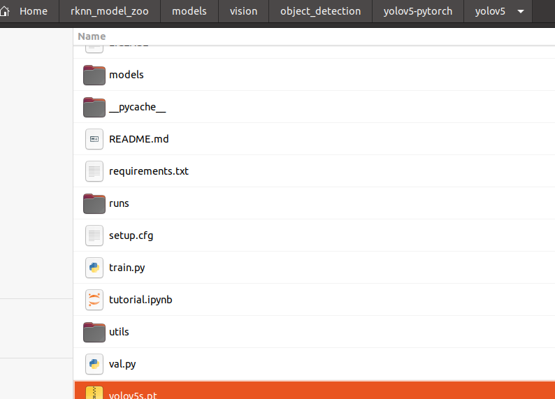

# Prepare the dataset

- Download the raw dataset with `KITTI` format.

- Git clone: https://github.com/shaojun/fiftyone_scripts.git

- Process the `.zip` dataset file:

    Create a folder: `prepare_yolov5_dataset_from_kitti_format` at the same level of the fiftyone script:

    

    Put the downloaded `KITTI` dataset into the new folder of `prepare_yolov5_dataset_from_kitti_format`, and the download dataset file is like:  _project_labeling_door_closedsign_proj-2022_05_16_03_16_26-kitti 1.0.zip_ 

    Install the  _unzip_ tool by: `sudo apt-get install unzip`, and unzip the file with `unzip project_labeling_door_closedsign_proj-2022_05_16_03_16_26-kitti 1.0.zip`, you'll get unzipped folder structure like：

    

- Process the raw `KITTI` dataset with `cvdata` tools:

    `conda activate cvdata`, then follow https://gitee.com/bugslife/open_docs/blob/master/projects/ml_server/cvdata.md to  _rename, resize, convert_  image files, use image format `jpg` is OK, the `cvdata` processed data will be stored at `resized_image_2` and `resized_label_2`.
    


- Process with fiftyone

    First，rename  _resized_image_2_  and  _resized_label_2_  to  _data_  and  _labels_  respectively and cut to above level of folder:

    

    Second, run the script to split dataset and export to yolov5 dataset format, you'll get the export dataset in folder:

    

    

    then the above 1 file and 2 folders are used as the final yolov5 training dataset.


# Training

## Prepare the training repo

if you're using rockchip board, follow this to clone and patch the repo:
https://github.com/airockchip/rknn_model_zoo/tree/main/models/vision/object_detection/yolov5-pytorch#%E4%B8%8B%E8%BD%BD%E4%BB%93%E5%BA%93%E5%B9%B6%E6%89%93%E4%B8%8Apatch

## Orgnize dataset
put elenet dataset(dataset.yaml, images/, labels/) into the folder of  _yolov5_ repo , refer folder structure:   


but you need to update the path in _dataset.yaml_ by adding the prefix `./data/elenet`, otherwise the train script will say data folder could not be found. so finally it looks like:
```
names:
- electric_bicycle
- people
- door_warning_sign
- bicycle
- gastank
nc: 5
train: ./data/elenet/images/train/
val: ./data/elenet/images/val/
```

Download the pretrained model from: https://github.com/ultralytics/yolov5/releases/download/v6.1/yolov5s.pt and copy it to the same folder which `traing.py` exists:



## Start training

run the `train.py` scripts, default batch size 24 will use almost 20G GPU memory:
```
python3 train.py --epochs 50 --img 1280 --data data/elenet/dataset.yaml --weights ./yolov5s.pt --batch-size 24
```

## Test the trained model

by using the `detect.py` scripts, the `exp3` may be changed in your case:
```
python3 detect.py --weights ./runs/train/exp3/weights/last.pt --imgsz 1280 --source ~/Videos/yang_office_demoEle_combined_multiple_sections_4classes.mp4 
```

check the `detect` result at `yolov5/runs/detect/exp`

## Export the model

`export` for latest yolov5 repo:

if you're using rockchip board, then(you  **must have applied**  the patch from rknn_model_zoo) [refer](https://github.com/airockchip/rknn_model_zoo/tree/main/models/vision/object_detection/yolov5-pytorch), or for short:

```
# 在yolov5 目录下执行以下命令，即可导出针对npu优化的模型，同时打印并将anchors保存成txt文件。
python export.py --rknpu {device_platform}
# device platform 替换成手上板子对应的平台，有以下选择 [rk1808/rv1109/rv1126/rk3399pro/rk3566/rk3568/rk3588]
```

if you're not using board, then:

```
python3 export.py --data=data/elenet/dataset.yaml --weights runs/train/exp3/weights/last.pt --img 1280 --batch 1 --opset 12
```

# Export to .ONNX

**onnx 1.6.0 only support python3.7** 
`export` for rknn specified(commit id:  _c5360f6e7009eb4d05f14d1cc9dae0963e949213_  use: `git checkout c5360f6e7009eb4d05f14d1cc9dae0963e949213` to switch to, or `git checkout origin` to re-point to latest HEAD) yolov5 repo:
```
python3 export.py --weights runs/train/exp/weights/last.pt --img 1280 --batch 1 --opset 12
```
should see `last.onnx` and `last.torchscript` are there under `runs/train/exp3/weights/`

`simplifier` for rknn specified version, for the `.onnx` model as required by RKNN:
pip3 install onnx-simplifier
```
python3 -m onnxsim runs/train/exp/weights/last.onnx  runs/train/exp/weights/elenet_yolov5s.onnx
```

