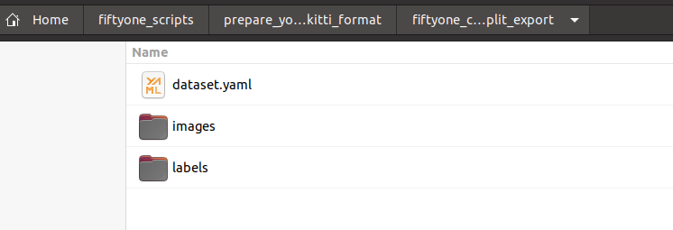

# Prepare the dataset

## Download the raw dataset with `KITTI` format.
the downloaded file is like: _project_labeling_door_closedsign_proj-2022_05_16_03_16_26-kitti 1.0.zip_

## Unzip the raw dataset
Git clone: https://github.com/shaojun/fiftyone_scripts.git

Create a folder: `prepare_yolov5_dataset_from_kitti_format` at the same level of the fiftyone script（just cloned）:


Put the downloaded `KITTI` dataset file (like: _project_labeling_door_closedsign_proj-2022_05_16_03_16_26-kitti 1.0.zip_) into the new folder of `prepare_yolov5_dataset_from_kitti_format`.   

Install the  _unzip_ tool by: 
```
sudo apt-get install unzip
```
and unzip the file with `unzip project_labeling_door_closedsign_proj-2022_05_16_03_16_26-kitti 1.0.zip`, you'll get unzipped folder structure like：


## Process the `KITTI` dataset with `cvdata` tools

Create your `cvdata` conda env.

Activate your `cvdata` env with: `conda activate cvdata`.

Then follow https://gitee.com/bugslife/open_docs/blob/master/projects/ml_server/cvdata.md to  _rename(.jpeg to .jpg, .PNG to .png), resize, convert(.png to .jpg)_  image files, use image format `jpg` is OK.

The processed data will be stored at folder: `resized_image_2` and `resized_label_2`.

Deactivate your conda env: `conda deactivate`   


## Process the `KITTI` dataset with `fiftyone` tools

The purpose here is for `train/val` folder split, and yolov5 dataset format conversion.

Create your `fiftyone` conda env.

Activate your `fiftyone` env with: `conda activate fiftyone`.

* Rename  _resized_image_2_  and  _resized_label_2_  to  _data_  and  _labels_  respectively and cut to above level of folder, then you'll get:


* run the script to split dataset and export to yolov5 dataset format, you'll get the export dataset in folder:





then the above `.yaml` and 2 folders are used as the yolov5 training dataset.

Deactivate your conda env: `conda deactivate`

# Prepare the training
There're 2 ways from `rockchip` that are provided for training on [yolov5](https://github.com/ultralytics/yolov5).
## rknn-toolkit 1.7.1 based

git clone [yolov5](https://github.com/ultralytics/yolov5) firstly, then use: 
```git checkout c5360f6e7009eb4d05f14d1cc9dae0963e949213``` 
to switch to the target commit.
>You still can: `git checkout origin` to re-point to latest HEAD.

## rknn_model_zoo based

follow this to clone and patch the repo:
https://github.com/airockchip/rknn_model_zoo/tree/main/models/vision/object_detection/yolov5-pytorch#%E4%B8%8B%E8%BD%BD%E4%BB%93%E5%BA%93%E5%B9%B6%E6%89%93%E4%B8%8Apatch

## Organize dataset into local Yolov5 repo
Put elenet dataset(_dataset.yaml_, _images/_, _labels/_) into the folder of  _yolov5/data/elenet/_ , like this: 


But you need to update the path in _dataset.yaml_ by adding the prefix `./data/elenet`, otherwise the train script will say _data folder could not be found_. so finally the _dataset.yaml_ looks like:
```
names:
- electric_bicycle
- people
- door_warning_sign
- bicycle
- gastank
nc: 5
train: ./data/elenet/images/train/
val: ./data/elenet/images/val/
```
Download the pretrained model from: https://github.com/ultralytics/yolov5/releases/download/v6.1/yolov5s.pt and copy it to the same folder which `traing.py` exists:


## Start training
Create your `yolov5` conda env.
Activate your `yolov5` env with: `conda activate yolov5`.
Install the python3 packages by:
```
cd yolov5
pip install -r requriments.txt
```

run the `train.py` scripts, default batch size 24 will use almost 20G GPU memory:
```
python3 train.py --epochs 60 --img 1280 --data data/elenet/dataset.yaml --weights ./yolov5s.pt --batch-size 24
```
if you got cuda error, may caused by your conda already installed some old torch package for you, then uninstall all of them
```
pip uninstall torch
pip uninstall torch
pip uninstall torchaudio
pip uninstall torchvision
pip3 install torch torchvision torchaudio --extra-index-url https://download.pytorch.org/whl/cu113
python3
import torch
torch.__version__

pip list|grep torch
#should see below which are the correct versions:
torch                   1.11.0+cu113
torchaudio              0.11.0+cu113
torchvision             0.12.0+cu113

```
## Test the trained model

by using the `detect.py` scripts to do a test against a video file.
NOTE the below sample folder of `exp3` may be changed in your case:
```
python3 detect.py --weights ./runs/train/exp3/weights/last.pt --imgsz 1280 --source ~/Videos/yang_office_demoEle_combined_multiple_sections_4classes.mp4
```

check the `detect` result at `yolov5/runs/detect/exp`

Deactivate your cond env by: `conda deactivate`

# Export and convert to `.rknn` based on steps from `rknn_model_zoo` (doesn't work for me)

## check rv1126 board npu driver version
`strings /usr/lib/librknn_runtime.so | grep version`, if it's not `1.7.1` then need update, could clone the `https://github.com/rockchip-linux/rknpu` at the PC and then adb push to board, but never succeed here at one of the step with an error:

> (base) shao@yaoming:~/rknpu$ adb push drivers/linux-armhf-puma/   /
> adb: error: failed to copy 'drivers/linux-armhf-puma/usr/lib/libNNGPUBinary.so' to '/linux-armhf-puma/usr/lib/libNNGPUBinary.so': no response: Success
> 
> 

you could clone the https://github.com/rockchip-linux/rknpu at the board directly, and then:
`sudo cp -r drivers/linux-armhf-puma/usr/* /usr/`

then the another file:

```
#bak the old one
mv /lib/modules/galcore.ko /lib/modules/galcore.ko_bak
#copy in new one and rename 
mv ~/rknpu/drivers/npu_ko/galcore_puma.ko /lib/modules/galcore.ko
```

> (base) shao@yaoming:~/rknpu$ adb push drivers/npu_ko/galcore_puma.ko /lib/modules/galcore.ko
> drivers/npu_ko/galcore_puma.ko: 1 file...hed. 2.7 MB/s (445352 bytes in 0.155s)
> 

at last, `strings /usr/lib/librknn_runtime.so | grep version` again to confirm the version is `1.7.1`

## `Export` to `onnx`:

`git clone https://github.com/rockchip-linux/rknn-toolkit`
Create your `rknn_toolkit` conda env.
Activate the `rknn_toolkit` conda env.
`pip3 install -r packages/requriements-gpu.txt`
`pip3 install package/rknn_toolkit-1.7.1-cp35-cp35m-linux_x86_64.whl`


if you're using rockchip board, then(you  **must have applied**  the patch from rknn_model_zoo) [refer](https://github.com/airockchip/rknn_model_zoo/tree/main/models/vision/object_detection/yolov5-pytorch), or for short:

```
# 在yolov5 目录下执行以下命令，即可导出 **针对npu** 优化的模型，同时打印并将anchors保存成txt文件。
python3 export.py --data=data/elenet/dataset.yaml --weights runs/train/exp/weights/last.pt --img 1280 --batch 1 --opset 12 --rknpu rv1126

# device platform 替换成手上板子对应的平台，有以下选择 [rk1808/rv1109/rv1126/rk3399pro/rk3566/rk3568/rk3588]
```
you may see the errors for failed to export to .onnx model:

> ONNX: export failure: Descriptors cannot not be created directly.
> If this call came from a _pb2.py file, your generated code is out of date and must be regenerated with protoc...

then you need  **downgrade**  your protobuf with: `pip install protobuf==3.20.1`, and then re-run the `export ...`, then you'll get the `.onnx` model file, and anchor file:


if you're not using board, then:

```
python3 export.py --data=data/elenet/dataset.yaml --weights runs/train/exp3/weights/last.pt --img 1280 --batch 1 --opset 12
```

# Export and convert to `.rknn` based on the steps from `rknn_toolkit`

`git clone https://github.com/rockchip-linux/rknn-toolkit`
Create your `rknn_toolkit` conda env.
Activate the `rknn_toolkit` conda env.
`pip3 install -r packages/requriements-gpu.txt`
`pip3 install package/rknn_toolkit-1.7.1-cp35-cp35m-linux_x86_64.whl`
`pip3 install onnx==1.6.0`

you may need install `onnx` and `coremltools` for your conda:
```
pip install onnx==1.6.0
pip install coremltools
```

## Export to `.onnx`

then go with `export.py`:
```
python3 export.py --weights runs/train/exp/weights/last.pt --img 1280 --batch 1 --opset 12
```
should see `last.onnx` and `last.torchscript` are there under `runs/train/exp3/weights/`

Optional for simplifier(I didn't do it)?

`simplifier` for rknn specified version, for the `.onnx` model as required by RKNN:
pip3 install onnx-simplifier
```
python3 -m onnxsim runs/train/exp/weights/last.onnx  runs/train/exp/weights/elenet_yolov5s.onnx
```

## Get the 3 Conv Node name

open the `.onnx` with Netron, find these nodes and it's OUTPUTS name:


and input into here for convert (to `.rknn`):


prepare `dataset.txt` for  **QUANTIZE** , you can create a folder under `rknn-toolkit/examples/onnx/yolov5` with name `images`, and put into 200-500 images files in it, and then compose the `dataset.txt` with content like:


> images/frame_000177.jpg
>
> images/frame_000178.jpg
>
> images/frame_000180.jpg
>
> images/frame_000181.jpg
>
> images/frame_000182.jpg
>
> images/frame_000183.jpg
>
> images/frame_000185.jpg
> ...

## Convert to `.rknn`

run for convert to `.rknn` model, the `infer` will take minutes to finish, but actually the `.rknn` has already generated:

```(rknntk) shao@yaoming:~/rknn-toolkit/examples/onnx/yolov5$ python3 test.py ```

