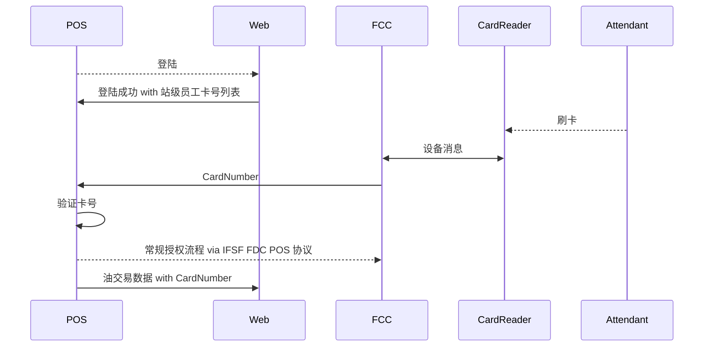

# Requirements
1. 在前庭支持读卡器设备
    一读卡器能够与1个或者多个加油点进行绑定, 即在此读卡器上通过认证等一系列流程后的加油员所持的卡片, 可对这些加油点进行授权.
2. Web 后端可对完成的加油交易按其被授权的加油员卡片进行统计
    以实现对加油员的工作量进行统计和管理。

3. Web 后端可以对卡片和加油员的绑定关系进行管理
    以实现对加油员的授权和管理。

# 实现
